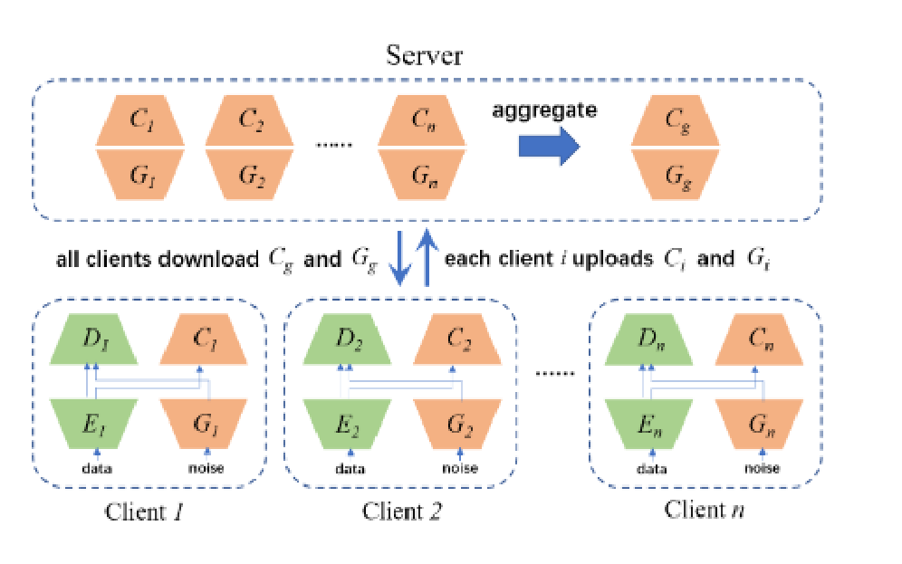
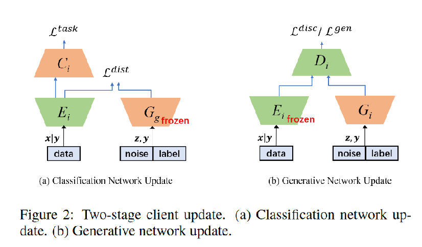
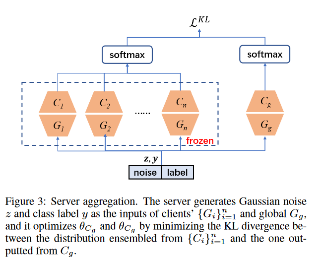

# FedCG: Leverage Conditional GAN for Protecting Privacy and Maintaining Competitive Performance in Federated Learning

## Q：文章干了什么？

FedCG是Wu等人提出的一种新型联邦学习方法，它采用条件生成对抗网络（cGANs）在保护隐私的同时保持联邦学习模型的竞争性能。FedCG通过将每个客户端的本地网络分为私有提取器和公共分类器，保持提取器在本地以保护隐私。与其共享提取器，FedCG更是共享客户端的生成器到中央服务器来聚合共享知识，旨在提高本地网络的性能。这种方法大大降低了客户端数据泄露的风险，并使用知识蒸馏聚合客户端的生成器和分类器，而不需要公共数据，展示了在隐私保护和模型性能之间的一个有希望的平衡。

## Q：条件生成对抗网络cGANs是什么，与生成对抗网络的区别？

条件生成对抗网络（cGANs）是生成对抗网络（GANs）的一个扩展，它在生成过程中引入了额外的条件或标签信息，以控制生成数据的特定属性或类型。这些条件可以是类别标签、文本描述、图像等，允许模型生成符合特定条件的数据，从而提高了生成数据的多样性和可控性。

cGANs与标准GANs的主要区别在于：

1. **条件信息的引入**：在cGANs中，生成器和鉴别器的输入都包含了条件信息。这使得生成器能够根据条件信息生成特定类型的数据，而鉴别器则需要同时考虑数据和条件信息来判断数据的真实性。

2. **目标函数的修改**：cGANs的目标函数相比于标准GANs进行了修改，以包含条件信息。这意味着生成器的目标不仅是欺骗鉴别器，使其将生成的数据判断为真实的，而且还要确保生成的数据满足给定的条件。

3. **应用范围的扩展**：通过引入条件信息，cGANs可以用于更多特定的应用场景，如条件图像合成、条件样本增强、目标驱动的图像编辑等，这在标准GANs中是难以直接实现的。

简而言之，cGANs通过在GANs的框架中加入条件信息，为生成的数据提供了一个可控的方向，使生成的数据不仅多样且符合特定的条件要求，极大地扩展了GANs的应用领域。

## Q：cGANs如何实现？

FedCG中的cGANs通过下面的方式实现：

1. **条件生成对抗网络（cGAN）**：cGAN由生成器\(G\)和鉴别器\(D\)组成。在FedCG中，每个客户端提供了一个具有生成器\(G_i\)和鉴别器\(D_i\)的cGAN。生成器的目的是产生与真实数据分布相匹配的数据，而鉴别器则尝试区分生成的数据与真实数据。

2. **训练过程**：cGAN的训练目标是最小化生成器和鉴别器的损失函数。在FedCG中，每个客户端本地训练其cGAN，然后上传其生成器到服务器。服务器使用知识蒸馏方法聚合所有客户端的生成器，以构建一个全局生成器。

3. **损失函数**：
   - **分类损失**(\(L_{cls}\))：使用交叉熵损失函数，优化客户端的特征提取器和分类器。
   - **距离损失**(\(L_{dist}\))：通过最小化均方误差损失，将全局生成器聚合的知识整合到本地提取器中。
   - **任务损失**(\(L_{task}\))：是分类损失和距离损失的组合，用于同时优化分类性能和知识整合。

4. **鉴别器和生成器损失**：在生成网络更新阶段，每个客户端通过最小化生成器损失(\(L_{gen}\))和鉴别器损失(\(L_{disc}\))来训练其cGAN。这些损失函数根据生成的数据与真实数据的相似度来调整，以改进生成器产生数据的能力。

通过这种方式，FedCG在保护数据隐私的同时，利用cGAN生成的数据来提高联邦学习模型的性能。这个过程允许在不直接共享敏感数据的情况下，在各个客户端之间共享知识，从而在联邦学习环境中实现高效且隐私保护的模型训练。

## Q：FedCG如何实现，模型架构是什么样的？

FedCG的实现和模型架构主要包括以下几个关键组成部分：

1. **客户端网络分解**：FedCG将每个客户端的本地网络分解为私有提取器（Extractor）和公共分类器（Classifier）。私有提取器保留在客户端以保护隐私，而公共分类器和生成器（Generator）可以与服务器共享。

2. **客户端更新**：客户端更新分为两个阶段：分类网络更新和生成网络更新。
   - 在分类网络更新阶段，客户端通过最小化分类损失(\(L_{cls}\))来优化提取器和分类器。此外，客户端还希望将全局生成器（在上一轮中聚合）中嵌入的共享知识整合到其本地提取器中，通过最小化均方误差损失(\(L_{dist}\))来实现。
   - 生成网络更新阶段，客户端冻结提取器的参数，执行cGAN训练过程来训练生成器，以使本地生成器的输出接近其本地提取器提取的特征表示。

3. **服务器聚合**：服务器利用知识蒸馏来执行聚合。服务器接收客户端上传的生成器和分类器，然后初始化全局生成器和全局分类器的参数，通过加权平均的方式来完成。聚合过程中，服务器首先生成一批训练数据，然后将这些数据输入到所有生成器中，计算类别概率分布，并通过最小化KL散度来优化全局分类器和生成器。

4. **隐私分析**：FedCG通过比较在FedCG中恢复的图像数据质量与其他方法恢复的数据质量，来评估其隐私保护能力。FedCG通过隐藏私有提取器并共享生成器的方式，有效地保护了数据隐私，同时通过聚合共享的知识来提高模型性能。

### 相关公式如下：

- 分类损失：$$L_{cls} = E_{xy \sim X_i} [\Omega(C_i(E_i(x|y; \theta_{E_i}); \theta_{C_i})) y]$$

- 距离损失：$$L_{dist} = E_{xy \sim X_i} E_{z \sim Z} ||E_i(x|y; \theta_{E_i}) - G_g(z, y; \theta_{G_g})||^2$$

- 任务损失：$$L_{task} = L_{cls} + \gamma L_{dist}$$

- 生成器和鉴别器损失：

  $$L_{disc} = E_{xy \sim X_i} E_{z \sim Z} [\log(1 - D_i(E_i(x|y; \theta_{E_i}); \theta_{D_i})) + \log D_i(G_i(z, y; \theta_{G_i})+ \theta_{D_i})$$

  $$L_{gen} = E_{xy \sim X_i} E_{z \sim Z} [\log(1 - D_i(G_i(z, y; \theta_{G_i}); \theta_{D_i}))]$$

这些公式共同描述了FedCG如何通过将客户端网络分解、利用条件生成对抗网络（cGAN）以及服务器聚合的方法来保护隐私并提高联邦学习系统的性能。

## Q：FedCG如何保护隐私？

1. **分解本地网络**：FedCG将每个客户端的本地网络分解为私有提取器和公共分类器。私有提取器保留在客户端本地，以保护隐私，而不是像传统的联邦学习方法那样，服务器可以完全访问客户端的本地网络。

2. **共享生成器而非提取器**：与其公开提取器，FedCG选择共享客户端的生成器到服务器。这样做的目的是聚合客户端共享的知识，以提高每个客户端本地网络的性能。这一策略显著降低了客户数据泄露的可能性，因为不会暴露直接接触原始数据的模型。

3. **知识蒸馏**：服务器可以通过知识蒸馏聚合客户端的生成器和分类器，而无需访问任何公共数据。这意味着即使在不共享敏感数据的情况下，也能在客户端之间共享知识，从而在保护隐私的同时实现高效的模型训练。

4. **隐私分析**：FedCG还进行了隐私分析，通过比较在FedCG中恢复的图像数据质量与FedAvg和FedSplit等方法恢复的数据质量，来评估其隐私保护能力。结果显示，FedCG能够在保持竞争性模型性能的同时，提供高水平的隐私保护能力。

## Q：方法介绍：

在本工作中，我们考虑了典型的联邦学习（FL）设置，其中包括一个中央服务器和N个拥有私有数据集的客户端。这些私有数据集共享相同的特征空间但拥有不同的样本空间。每个客户端\( i \)都有一个由参$ \theta_{c,i} = [\theta_{e,i}; \theta_{c,i}] $参数化的分类网络组成，其中包括一个**特征提取器$ E_i : \mathcal{X} \rightarrow \mathbb{R}^d $**由参数$ \theta_{e,i} $参数化，和一个**分类器$ C_i : \mathbb{R}^d \rightarrow \mathbb{R}^c $**由参数$ \theta_{c,i} $参数化，这里\( d \)是特征维度，\( c \)是类别数量。为了保护隐私并维持竞争性能，每个客户端都配备了一个由**生成器$G_i : \mathcal{Z} \rightarrow \mathbb{R}^d $**和**鉴别器$D_i : \mathbb{R}^d \rightarrow \mathcal{I} $**组成的条件生成对抗网络（cGAN），其中$ \mathcal{Z} $是高斯分布，并且$ \mathcal{I} $表示的是[0, 1]范围内的单个标量。cGAN的训练过程在本地进行，目的是训练生成器 $G_i $以逼近提取器$ E_i $提取的特征分布，使得$ G_i(z,y) $捕获了由$ E_i(x|y) $提取的特征分布。

分类器C，生成器G，E特征提取器,D判别器

如图1所示，FedCG的工作流程如下：在每轮FL通信中，每个客户端\( i \)上传其生成器\( G_i \)和分类器\( C_i \)到服务器；一旦本地训练完成，服务器应用知识蒸馏来构建全局生成器\( G_g \)和全局分类器\( C_g \)以增强隐私保护。接下来，客户端下载\( G_g \)和\( C_g \)以替换他们相应的本地模型，并开始下一轮迭代训练。在整个FedCG周期中，客户端与中央服务器的帮助下，协同训练了生成器和分类器。

### (a) **分类网络更新（Classification Network Update）**：

- 这一阶段，客户端使用其数据（标记为`data`）来训练特征提取器\( E_i \)和分类器\( C_i \)。
- 数据\( x \)在给定标签\( y \)的条件下通过**特征提取器\( E_i \)生成特征。**
- 然后，这些特征被用来训练分类器\( C_i \)，并通过任务损失$ \mathcal{L}_{task} $进行优化，任务损失：$$L_{task} = L_{cls} + \gamma L_{dist}$$
- 在这个阶段，生成器\( G_i \)被冻结（标记为`Gg frozen`），意味着它不参与更新。

### (b) **生成网络更新（Generative Network Update）**：

- 在这一阶段，客户端固定（冻结）其特征提取器\( E_i \)（标记为`Ei frozen`），不再更新它。
- 使用随机噪声\( z \)和标签\( y \)作为输入，**生成器\( G_i \)生成相应的特征。**
- 这些生成的特征被送入鉴别器\( D_i \)，鉴别器尝试区分生成的特征与真实数据特征。
- 生成网络通过生成器损失$ \mathcal{L}_{gen} $和鉴别器损失$ \mathcal{L}_{disc} $进行训练和优化。

这两个阶段共同协作，旨在训练出能够生成质量高、有助于分类任务的特征，同时又保持了模型隐私的生成网络。通过这样的两阶段更新，FedCG能够在每个客户端本地有效地提取特征和生成特征，而不需要共享实际的用户数据。

### 云端聚合

在服务器端聚合中，通过知识蒸馏的方式聚合一个公共分类器 Cg 和一个公共生成器 Gg。然后，服务器下发公共分类器和公共生成器给每个客户端。

1. **收集客户端上传的生成器和分类器**：服务器从所有客户端接收生成器（$\{G_i\}_{i=1}^n$）和分类器（$\{C_i\}_{i=1}^n$），其中每个客户端上传其本地训练完成的生成器和分类器。

2. **初始化全局生成器和分类器**：服务器通过加权平均客户端上传的生成器和分类器的参数，初始化全局生成器（$\theta_{G_g}$）和全局分类器（$\theta_{C_g}$）。

3. **生成训练数据**：服务器生成一个小批量的训练数据（\(z, y\)），其中标签\(y\)从均匀分布\(U(0, c)\)中采样，噪声\(z\)从高斯分布\(N(0, 1)\)中采样。

4. **计算类别概率分布**：服务器将生成的数据（\(z, y\)）输入到所有客户端的生成器和全局生成器中，计算由客户端分类器集合整合得到的类别概率分布$P_c(y, z)$和由全局分类器得到的类别概率分布$P_s(y, z)$。

5. **最小化KL散度优化全局模型**：服务器通过最小化两个分布之间的KL散度来优化全局分类器（$\theta_{C_g}$）和全局生成器（$\theta_{G_g}$）。这个步骤是**知识蒸馏的核心，目的是将客户端模型的知识有效地转移到全局模型中**。

6. **迭代训练和更新**：重复上述过程若干次（\(T\)次迭代），在每次迭代中，服务器都会根据最小化的KL散度更新全局生成器和全局分类器的参数。

7. **分发全局模型**：聚合和优化过程完成后，服务器将优化后的全局生成器和全局分类器发送回所有客户端。客户端使用这些全局模型来替换或更新其本地模型，以进行下一轮的训练迭代。

## Q：DLG是什么？

深度梯度泄露（Deep Leakage from Gradients, DLG）攻击是一种针对深度学习模型的隐私攻击方法。在联邦学习环境中，尽管原始数据保留在客户端不被共享，但模型的梯度（即模型参数的更新）需要上传到服务器以进行聚合和更新全局模型。DLG攻击利用这些共享的梯度信息来重构客户端的原始数据和标签。

DLG攻击的基本思想是通过优化过程反向推导出输入数据，具体步骤如下：

1. **初始化模拟数据**：攻击者创建一组随机初始化的模拟数据和标签。
2. **前向传播和计算梯度**：使用模拟数据通过受攻击的模型进行前向传播，并计算梯度。
3. **梯度匹配**：将计算出的梯度与从真实客户端上传的梯度进行比较，通过计算二者之间的差异（通常使用欧氏距离或余弦相似度）。
4. **优化模拟数据**：通过反向传播和梯度下降方法优化模拟数据和标签，目标是最小化步骤3中计算的梯度差异。
5. **迭代重复**：重复步骤2至4，直到模拟数据生成的梯度与真实梯度足够接近。

通过这种方式，DLG攻击能够在不直接访问原始数据的情况下，仅使用梯度信息重构出与原始数据相似的数据和标签。这种攻击揭示了即使不共享数据，仅共享模型更新（梯度）也可能导致隐私泄露的风险。

为了防御DLG攻击，研究者提出了多种策略，如差分隐私（Differential Privacy）、模型参数量化（Quantization）、梯度剪裁（Gradient Clipping）等，旨在在不显著影响模型性能的前提下减少梯度中包含的敏感信息。

## Q：GAN在FL的相关工作？

最近在 FL 设置中利用 GAN 的研究工作主要集中在两方面：一是利用 GAN 执行数据恢复攻击。 [Hitaj et al., 2017] 假设一个恶意客户端利用共享模型作为判别器来训练 GAN 中的生成器。然后，使用经过训练的生成器来模仿受害客户端的训练样本。另一个是在隐私、效率或异构性约束下跨分布式数据源训练高质量的 GAN。 MD-GAN [Hardy et al., 2019] 提出了一种系统，其中服务器托管生成器，而每个客户端托管鉴别器。鉴别器以点对点的方式相互通信，以提高计算效率。 FedGAN [Rasouli et al., 2020] 以有效通信的方式跨非独立同分布数据源训练 GAN，但它可能会产生有偏差的数据。

## Q：什么是知识蒸馏？https://zhuanlan.zhihu.com/p/258390817

知识蒸馏是一种压缩和转移学习模型知识的技术，主要用于模型压缩和提高模型性能。它的**基本思想是将一个大型、复杂的模型（通常称为“教师模型”）的知识传递给一个小型、简单的模型（通常称为“学生模型”）**，使学生模型能够达到或接近教师模型的性能。

知识蒸馏过程通常包括以下几个步骤：

1. **训练教师模型**：首先，训练一个大型的教师模型，这个模型通常有很高的准确率但计算量大，不易部署。

2. **蒸馏知识**：然后，通过训练过程中让学生模型学习教师模型的输出（通常是softmax层的输出概率分布）来蒸馏知识。这一过程可以通过直接匹配教师和学生模型的输出，或者通过一些技术手段（如温度softmax）来软化输出概率，使学生模型可以从教师模型学习到更多的细微差别。

3. **训练学生模型**：通过知识蒸馏，**学生模型学习到了教师模型的知识**，即使其结构更简单，参数更少，但能够达到相当的性能。

在FedCG中，知识蒸馏用于在不共享客户端原始数据的情况下，将多个客户端的生成器（学生模型）的知识聚合到一个全局生成器（教师模型）。这允许每个客户端通过学习全局生成器聚合的知识来提高其模型性能，同时保护了数据隐私。

知识蒸馏（knowledge distillation）是模型压缩的一种常用的方法，不同于模型压缩中的剪枝和量化，知识蒸馏是通过构建一个轻量化的小模型，利用性能更好的大模型的监督信息，来训练这个小模型，以期达到更好的性能和精度。最早是由Hinton在2015年首次提出并应用在分类任务上面，这个大模型我们称之为teacher（教师模型），小模型我们称之为Student（学生模型）。来自Teacher模型输出的监督信息称之为knowledge(知识)，而student学习迁移来自teacher的监督信息的过程称之为Distillation(蒸馏)。

### 1.2 知识蒸馏的种类

图1 知识蒸馏的种类

**1、 离线蒸馏**

离线蒸馏方式即为传统的知识蒸馏，如上图（a）。用户需要在已知数据集上面提前训练好一个teacher模型，然后在对student模型进行训练的时候，利用所获取的teacher模型进行监督训练来达到蒸馏的目的，而且这个teacher的训练精度要比student模型精度要高，差值越大，蒸馏效果也就越明显。一般来讲，teacher的模型参数在蒸馏训练的过程中保持不变，达到训练student模型的目的。蒸馏的损失函数distillation loss计算teacher和student之前输出预测值的差别，和student的loss加在一起作为整个训练loss，来进行梯度更新，最终得到一个更高性能和精度的student模型。

**2、 半监督蒸馏**

半监督方式的蒸馏利用了teacher模型的预测信息作为标签，来对student网络进行监督学习，如上图（b）。那么不同于传统离线蒸馏的方式，在对student模型训练之前，先输入部分的未标记的数据，利用teacher网络输出标签作为监督信息再输入到student网络中，来完成蒸馏过程，这样就可以使用更少标注量的数据集，达到提升模型精度的目的。

**3、 自监督蒸馏**

自监督蒸馏相比于传统的离线蒸馏的方式是不需要提前训练一个teacher网络模型，而是student网络本身的训练完成一个蒸馏过程，如上图（c）。具体实现方式 有多种，例如先开始训练student模型，在整个训练过程的最后几个epoch的时候，利用前面训练的student作为监督模型，在剩下的epoch中，对模型进行蒸馏。这样做的好处是不需要提前训练好teacher模型，就可以变训练边蒸馏，节省整个蒸馏过程的训练时间。

### 1.3 知识蒸馏的功能

**1、提升模型精度**

用户如果对目前的网络模型A的精度不是很满意，那么可以先训练一个更高精度的teacher模型B（通常参数量更多，时延更大），然后用这个训练好的teacher模型B对student模型A进行知识蒸馏，得到一个更高精度的模型。

**2、降低模型时延，压缩网络参数**

用户如果对目前的网络模型A的时延不满意，可以先找到一个时延更低，参数量更小的模型B，通常来讲，这种模型精度也会比较低，然后通过训练一个更高精度的teacher模型C来对这个参数量小的模型B进行知识蒸馏，使得该模型B的精度接近最原始的模型A，从而达到降低时延的目的。

**3、图片标签之间的域迁移**

用户使用狗和猫的数据集训练了一个teacher模型A，使用香蕉和苹果训练了一个teacher模型B，那么就可以用这两个模型同时蒸馏出一个可以识别狗，猫，香蕉以及苹果的模型，将两个不同与的数据集进行集成和迁移。

## Q:如何用到预测任务呢？

要将知识蒸馏应用到预测任务中，你可以遵循以下步骤：

### 1. 定义教师模型和学生模型
- **教师模型**：选择一个已经训练好且在目标预测任务上表现良好的大型模型。这个模型通常复杂、参数众多，能够提供高准确率的预测。
- **学生模型**：选择或设计一个相对较小、更简单的模型作为学生模型。学生模型的目标是在保持可接受预测性能的同时，减少模型的复杂度和计算需求。

### 2. 准备数据集
- 准备用于训练学生模型的数据集。这可以是完整的训练数据集，也可以是一个较小的子集。重点是要保证数据覆盖了教师模型训练时使用的特征空间。

### 3. 设计蒸馏策略
- **软标签蒸馏**：让学生模型学习教师模型输出的概率分布（即软标签），而不是硬标签。软标签携带更多关于类别之间关系的信息，有助于学生模型更好地学习。
- **特征蒸馏**：除了输出层之外，还可以从教师模型的中间层提取特征，引导学生模型学习教师模型的内部表示。
- **自定义损失函数**：设计损失函数来衡量学生模型与教师模型在预测输出或特征表示上的差异。常见的是使用KL散度或均方误差（MSE）作为损失函数的一部分。

### 4. 训练学生模型
- 使用准备好的数据集和蒸馏策略训练学生模型。训练过程中，学生模型的目标是最小化其预测与教师模型预测之间的差异，同时可能还包括一些正则化项来避免过拟合。

### 5. 评估和调优
- 在独立的验证集上评估学生模型的性能。比较学生模型与教师模型以及其他基线模型的预测准确率、运行时性能等指标。
- 根据评估结果调整学生模型的结构、蒸馏策略或训练过程，以进一步提高性能或效率。

### 应用示例
假设你的预测任务是天气预测，你有一个表现良好的大型神经网络模型作为教师模型。你可以设计一个较小的神经网络作为学生模型，并通过知识蒸馏让它学习教师模型的预测能力。这样，即便是在资源受限的设备上，学生模型也能提供准确的天气预测，同时保持较低的计算成本。

通过这种方式，知识蒸馏为提高预测任务中的模型性能和效率提供了一个有效的框架，尤其适合于需要轻量级模型的应用场景。