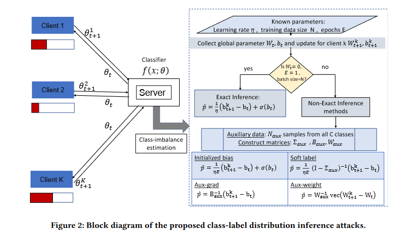

# Inferring Class-Label Distribution in Federated Learning（四种新的方法来估计一般FL设置下的类标签分布）

## Q: 论文是做什么的，摘要第一段

- 基于发送到参数服务器的模型参数更新，从对抗的角度研究类标签分布推断问题。
- 提出可以进行精确推断的条件。
- 引入四种新方法来估计一般 FL 设置中的类标签分布。
- 在四个不同的数据集上评估了所提出的推理方法，结果表明它们明显优于最先进的方法。
- 关键词：联邦学习、类不平衡、隐私泄露、类标签分布

## Q:什么是标签分布推理攻击



在这个背景下，系统旨在估计类别不平衡，可能是为了识别学习过程中可能被对抗性攻击所利用的脆弱性或弱点。以下是图中描绘的组件和过程的细分：

1. **多个客户端**：它们由“客户端1”到“客户端K”代表，每个客户端的参数（θ¹, θ², ..., θᴷ）随时间（t到t+1）更新。

2. **服务器**：中央服务器接收客户端的更新，并更新分类器函数 f(x; θ)。

3. **分类器**：这是一个被训练用于使用参数θ对输入数据x进行分类的模型。

4. **类别不平衡估计**：这是服务器估计数据中不同类别分布的过程。

5. **学习率（η）**：这是一个控制模型在训练期间更新程度的参数。

6. **全局参数（Wt）**：这是模型在时间t的权重。

7. **批处理大小**：这指的是在模型更新之前处理的样本数量。

该图还包括一个决策点，用于确定基于批处理大小是否大于或等于阈值N的情况下是否可以进行精确推断。如果无法进行精确推断，则考虑非精确推断方法。右侧的框详细说明了过程的更多技术性方面，指出了精确推断和非精确推断之间的区别，并附有计算偏差、软标签、梯度（Aux-grad）和权重（Aux-weight）的公式，辅以辅助数据。

## Q: 为了什么而做

- 从性能的角度来看，类不平衡会对训练模型的分类准确性产生负面影响，因此检测和缓解它对于使用 FL 训练准确的模型非常重要。
- 从对抗的角度来看，客户训练数据的组成可能是客户不想透露的敏感信息。具有类别不平衡且标签分布可能敏感的应用程序，包括欺诈检测、索赔预测、默认预测、流失预测、垃圾邮件检测、异常检测、异常值检测、入侵检测和转换预测。

## Q: 有何优缺点

- 探讨在联邦学习环境中类标签分布推断的挑战和方法。论文重点在于理解和解决因类不平衡和隐私问题在联邦学习中产生的问题。作者提出了估计类标签分布的新方法，并讨论了这些方法在不同情况下的有效性。

- 论文还分析了与联邦学习中类标签分布推断相关的敌对方面，并建议采取措施以减少隐私泄露。这篇文档中的技术和发现对于提高联邦学习设置中模型的准确性和隐私性特别重要。

## Q: 解决了什么挑战

- 服务器扮演对手的角色，根据客户端与服务器共享的模型参数更新，尝试推断每个客户端的类标签分布。
- 讨论在某些条件下可以进行精确推理的情况，然后提出在一般情况下平均表现良好的估计器。我们的数值结果表明，所提出的推理方法优于标签成分估计的最先进方法[17]。
- 客户端可以利用的缓解措施，以便对手无法有效地推断类标签分布。
- 说明如何使用类标签分布的知识来提高 FL 模型的准确性。

## Q: 现有方法是怎么做的

- 使用类标签分布推理来解决联邦学习中的类不平衡问题
- 推理视为属性推理攻击的一种形式。更改损失函数 [3, 17] 或在每次迭代时有效地聚类或选择客户端来解决联邦学习中的类不平衡问题，以便通过更均匀的数据分布来更新模型参数 [5, 6、12、18]。对于这两种方法，类标签分布推断被用作中间步骤。

## Q: 作者的核心贡献（典型三段式）

- 本文是第一个提出一种针对任何类型的神经网络分类器的类标签分布的精确推理方法，并提出了一些假设参数的初始化。
-  对于不满足精确推理假设的情况，我们提出了四个估计器来推断联邦学习系统中的类标签分布。 
- 我们表明所提出的估计方法优于[17]中最先进的标签比例估计方法，并讨论了其优越性能的原因。 
- 重点关注对抗性环境中的类标签分布推断，我们表明随机过采样是一种非常有效的对策，可以使攻击无效。

## Q：4个estimators

- 初始化偏差
- 软标签
- 辅助偏差梯度
- 辅助权重梯度

1. **使用初始化偏差的推断**（Inference using initialized bias）：
   - 这种方法中，(23)式中的第二项通过初始化偏差的Softmax输出来近似。如果$(W^\ell)^T $的乘积较小或接近零，且在随后的迭代中偏差没有太大变化，则此近似具有很高的准确性。这种方法为客户端在全局迭代中的类标签分布提供了一个估计值。

2. **使用近似Softmax输出的推断**（Inference using approximated softmax output）：
   - 这个估计器使用从所有C个类别中采集的辅助数据（D_aux）来构建矩阵Σ，并通过近似Softmax输出来估计类标签分布。

3. **使用近似梯度的推断**（Inference using approximated gradient）：
   - 在这种方法中，同样使用了每个类别的辅助数据集D_aux。不同的是，这种方法使用辅助数据集来计算客户端在本地周期中的梯度之和的近似值。假设导致偏差变化的梯度之和由当模型单独用某一类别的数据更新时偏差的比例变化组成。具体来说，这种方法近似估计偏差更新为$ \sum_{i=1}^{\text{epochs}} (\text{bias}_{i+1} - \text{bias}_i) $【23†source】。

4. **使用最后一层的权重的推断**（Inference using weights from the last layer）：

## Q：软标签

软标签（Soft Labels）是机器学习中的一个概念，尤其在分类问题中应用广泛。与硬标签（Hard Labels）相对，软标签不是绝对的类别标签，而是表示每个类别的概率或置信度。在软标签中，一个样本可以同时属于多个类别，并为每个类别赋予一个概率值。软标签常见于深度学习模型中，尤其是在处理具有一定模糊性或多标签任务的场景时。

举例来说，在图像识别任务中，硬标签可能会将一张图片标记为“猫”，这意味着模型完全确定这张图片是猫。而软标签则可能会给出多个标签的概率，如“猫：0.8，狗：0.1，兔子：0.1”，表明这张图片有80%的概率是猫，但也有一定小概率是狗或兔子。

软标签的优点包括：

1. **提供更多信息**：软标签提供了关于各个类别的概率信息，有助于模型更好地理解和学习数据。
2. **减少过拟合**：由于软标签提供了不确定性的信息，它们可以帮助模型在训练时不过度适应特定的标签，从而减少过拟合。
3. **适用于模糊或重叠的类别**：在某些情况下，样本可能确实属于多个类别，或者类别之间存在一定的重叠。软标签能更好地处理这种情况。

## Q：AUC

AUC，全称为“Area Under the Curve”，即“曲线下面积”，是评估分类模型性能的一个重要指标。它通常与ROC曲线（Receiver Operating Characteristic Curve，接收者操作特征曲线）一起使用。

ROC曲线是一个用于评估二元分类系统的图形化工具，它将真阳性率（True Positive Rate，TPR）和假阳性率（False Positive Rate，FPR）进行对比。真阳性率是指正确识别为正例的正例占所有正例的比例，而假阳性率是指错误地识别为正例的负例占所有负例的比例。

AUC衡量的是ROC曲线下的面积大小，可以提供一个量化模型整体性能的指标。AUC的值通常介于0和1之间。AUC值越接近1，表示模型的分类效果越好；AUC值越接近0.5，则表示模型的效果接近随机分类。在实际应用中，AUC被广泛用于医学、金融和机器学习等领域，用以评估不同模型的性能。

## 如何理解这个代码

```
github有，但是好奇怪
```

结论：输入是，输出是，做了什么，做了信息交流

*找模型limitations可以问gpt*

*找缺点，如何解决可能为创新点？*

*experiment不用特别仔细看*