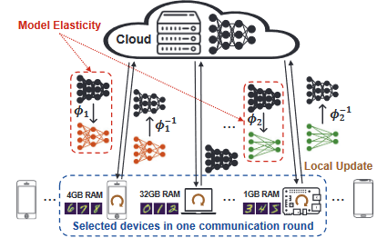
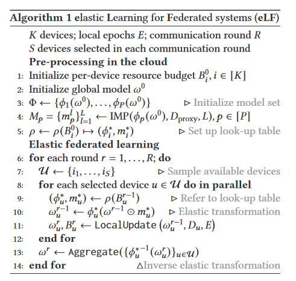

# Model elasticity for hardware heterogeneity in federated learning systems（边缘设备硬件异构性问题，不开源）

## Q: 论文是做什么的，摘要第一段

- 迄今为止提出的大多数联邦学习（FL）算法都是通过聚合通常共享相同架构的多个本地模型来获得全局模型，从而忽略了对边缘设备硬件异构性的影响。
- 为了解决这个问题，我们基于模型弹性的新概念提出了一种用于 FL 优化的模型架构协同设计框架。使本地设备能够训练属于同一架构系列的不同模型，选择这些模型来匹配各种边缘设备的资源预算（例如延迟、内存、功耗）。
- 在 EMNIST 和 CIFAR-10 上针对 IID 和非 IID 情况的结果显示，每轮通信传输的数据量减少了 2.44 倍，通信轮数减少了 100 倍，同时与现有技术相比，提供了相同或更好的精度接近。
- 关键词：联邦学习、边缘设备、硬件异构性、数据隐私、模型架构协同设计、通信成本、模型异构性、物联网

## Q:什么是模型弹性model elasticity？



- 弹性转换，将云中的复杂模型调整为分布在边缘设备上时满足特定硬件约束的较小模型。
- 将模型弹性与修剪[6]结合起来，以进一步减少模型大小、内存、推理时间以及云和边缘设备之间每轮通信的数据量。
- 因为可以选择不同的稀疏率来满足每个设备上的硬件约束，因此，稀疏性可以提供另一种形式的弹性（除了模型架构）。

## Q: 为了什么而做

解决边缘设备硬件异构性的影响，提高通信效率。

提出了“弹性”的新维度，使弹性模型能够适应每个设备的硬件限制。我们提出的模型弹性与其他现有的弹性想法正交，因此它们可以协同工作[5,19,21],模型选择的额外计算从资源受限的边缘设备转移到云端，从而将我们的方法与之前的工作（例如 [9,13,15]）区分开来.

## Q: 作者的核心贡献（典型三段式）

-  模型弹性的新概念。提出模型弹性，通过弹性变换将模型转换为自身更大或更小的版本，从而更好地适应异构设备的硬件约束。 
- 模型弹性和稀疏性的集成。我们通过采用迭代幅度剪枝（IMP）将稀疏性集成到模型弹性中，以减少通信和设备上的训练成本。这种额外形式的弹性使得可以选择 IMP 产生的稀疏率。
- 新的优化框架。我们提出了一种名为 eLF（联合系统的弹性学习）的约束优化框架，该框架考虑了各种边缘设备的异构资源预算、模型弹性和模型稀疏性。据我们所知，我们是第一个统一异构硬件、模型弹性和模型稀疏性的单位，以提高异构边缘设备上 FL 的通信效率。 
- 结果验证。我们在 **IID 和非 IID** 情况下使用 EMNIST [2] 和 CIFAR-10 [11] 数据集上的 Conv 和 ResNet 模型架构验证了所提出的框架。结果显示，每轮通信传输的数据量减少了 2.44 倍，通信轮数减少了 100 倍，同时与基线相比提供了相同或更好的精度。

## Q：迭代幅度剪枝（IMP）是什么，怎么做的？

IMP指的是迭代幅度修剪（Iterative Magnitude Pruning），它是一种通过迭代地剪除权重来增加模型稀疏度的方法。这种方法通过在每次迭代中去除一定比例的参数（权重），以达到降低通信和设备训练成本的目的。IMP在云中对一个代理数据集执行，以生成一系列具有递增稀疏度的稀疏掩码，这有助于在不牺牲模型性能的前提下减少模型大小和提高效率。

迭代幅度剪枝（Iterative Magnitude Pruning, IMP）是一种深度学习模型压缩技术，目的是通过迭代地剪除神经网络中权重的方式来减少模型的复杂性和大小。该过程通常包括以下步骤：

1. **训练**：首先，完全训练神经网络直到收敛。
2. **剪枝**：然后，根据权重的绝对值的大小对权重进行排序，并剪除那些最小的权重（例如剪除权重的比例可以是5%、10%等）。这些权重被设定为零。
3. **微调**：在剪枝后，对模型进行进一步的训练（微调），以恢复因剪枝而损失的性能。
4. **迭代**：重复上述剪枝和微调的步骤，直到达到所需的稀疏级别或者性能下降到无法接受的程度。

以下是一个简单的Python代码示例，展示了如何实现IMP中的剪枝步骤：

```python
import torch

def prune_by_magnitude(weight_tensor, prune_ratio):
    """
    Prunes the weights of a tensor by the magnitude of its elements.
    
    Args:
    - weight_tensor (torch.Tensor): The weight tensor to be pruned.
    - prune_ratio (float): The proportion of weights to prune.
    
    Returns:
    - torch.Tensor: The pruned weight tensor.
    """
    # Flatten the weight tensor to 1D
    weight_vec = weight_tensor.view(-1)
    # Compute the cutoff for pruning based on the prune ratio
    cutoff_index = int(prune_ratio * weight_vec.size(0))
    # Compute the threshold value for pruning
    threshold = torch.topk(torch.abs(weight_vec), cutoff_index, largest=False)[0][-1]
    # Create a mask where elements with abs value less than the threshold are set to 0
    mask = torch.abs(weight_vec) > threshold
    # Apply the mask to the weight tensor
    pruned_weight_vec = weight_vec * mask.float()
    # Reshape the pruned weight vector back to the dimensions of the original weight tensor
    pruned_weight_tensor = pruned_weight_vec.view(weight_tensor.size())
    return pruned_weight_tensor

# Example usage:
# Assume 'model' is an instance of a PyTorch model and 'prune_ratio' is set to 0.1 (10%)
for name, param in model.named_parameters():
    if 'weight' in name:
        pruned_weight = prune_by_magnitude(param.data, prune_ratio=0.1)
        param.data = pruned_weight
```

在这个示例中，`prune_by_magnitude`函数会接受一个权重张量和一个剪枝比率作为输入，然后根据权重的大小剪除其中一定比例的权重。请注意，这个代码示例只演示了单次剪枝操作。在实际应用中，需要将这个过程嵌入到完整的训练和微调循环中。此外，根据不同的框架和库，实现细节可能会有所不同。

## Q:eLF是什么？

- 联邦系统的弹性学习 (eLF)，elastic Learning for Federated systems (eLF)通过动态调整模型的大小来适应不同设备的计算能力，以此提高训练效率和加速模型的收敛。eLF算法的实现过程涉及在训练过程中对模型进行迭代修剪和恢复，以适应设备的性能变化，同时保持模型的学习能力。这种方法可以动态地为不同能力的设备定制模型大小，从而在不牺牲模型性能的前提下，减少通信成本和提高训练速度。



eLF：约束优化框架，在异构硬件约束下优化模型弹性和稀疏性。令 K 表示 FL 系统中的设备总数，每个设备都有一个预算 Bi,i ∈{1,...,K}，它描述了硬件约束，例如延迟、内存、带宽、功率（或某些其组合）。

1. 在云端为每个设备 \( i \) 初始化资源预算 \( B_0^i \)。
2. 初始化全局模型 \( \theta^0 \)。
3. 初始化模型集 \( \Phi \) 来存储不同大小的模型。
4. 通过迭代幅度修剪（IMP）方法和代理数据 \( D_{proxy} \) 生成模型修剪集 \( M_p \)。
5. 设置预算到模型大小的查找表 \( p \)。
6. 开始弹性联邦学习过程，对于每一轮通信 \( r \)：
   a. 随机抽取 \( S \) 个设备进行学习。
   b. 对于每个选中的设备 \( u \)，参照查找表确定模型和预算。
   c. 应用弹性变换到本地模型。
   d. 在设备上执行本地更新。
7. 聚合各设备的更新模型到全局模型。
8. 重复以上步骤直到学习结束。

该算法考虑了不同设备的计算能力和资源限制，使模型能在各个设备上有效学习，并通过聚合更新来改进全局模型。

## Q：IID和非IID是什么东西？

- IID（独立同分布）和非IID（非独立同分布）是数据分布的两种类型。
- IID假设每个数据点都是独立采样的，并且所有的数据点都遵循相同的分布。这在实际应用中往往不成立。
- 非IID数据分布意味着数据点之间存在依赖关系或者不同数据点遵循不同的分布。这在联邦学习中尤为重要，因为来自不同设备的数据通常不满足IID假设，处理非IID数据对于提高模型性能和泛化能力至关重要。

## Q: 现有方法是怎么做的？

- FedKD [24] 被提出，作为一种通信高效的 FL 方法，但它在设备上训练的不是一个模型，而是两个模型（即教师和学生），并且仅与以下模型共享较小的模型（即学生）。云为边缘设备带来计算开销。

- 稀疏神经网络 (NN) 已通过剪枝的形式得到深入研究，以实现高效、低延迟的设备端推理 [4, 6]。
- 最近，“彩票假说”（LTH）[3] 在随机初始化的神经网络（称为中奖彩票）中发现了稀疏子网络，这些子网络可以从头开始独立训练，以匹配训练有素的密集网络的性能。

-  [23]的作者利用下行广播来提高LotteryFL的通信效率，但忽视了设备的硬件异构性。 [12] 的作者扩展了 LotteryFL 的思想来学习设备个性化和结构化稀疏掩模，同时仅聚合它们重叠的非零元素。

然而，这些方法从密集模型开始，并根据本地验证性能指标运行设备上的剪枝，从而增加了内存和计算开销边缘设备。 

- PruneFL [10] 使用非结构化修剪来添加和删除每轮通信的权重，最终获得一张彩票，但不一定是最小的。 FL 的异质性主要是从数据异质性的角度来解决的[16,18,25]。很少有 FL 论文深入探讨异构硬件的影响以及相应的设计弹性需求 [8]。
-  FedMD [15] 提出了一个框架，使每个设备能够在本地设计自己的模型，同时通过迁移学习和知识蒸馏实现全局聚合。

- 像[5, 19]这样的作品对“弹性”一词采取了不同的观点。在[19]中，作者在局部目标函数中提出了一个弹性项，以改进非独立同分布数据和低设备参与率的优化。 [5]中提到的“弹性”与局部模型分配给每一层的权重有关，这些权重调整对全局模型的逐层贡献。

## Q:正弹性变换，反弹性变换？Direct and inverse elastic transformation

- 弹性变换在联邦学习系统中的使用导致每个边缘设备有不同的模型架构。为了在云中进行模型聚合，文中使用了逆弹性变换$( \Phi^{-1} )$将局部模型转换回全局模型的架构。这个过程涉及增加额外的层，即逆弹性变换 $/Phi^{-1} $ 会将模型“拉伸”到更深的版本。新加入的层中的权重值可以通过不同的方式设置，例如复制前面的层、填充随机分布或常数（例如零）。文中经验性地发现，用零填充提供了模型训练过程的稳定性，并因此获得了比其他方法更好的结果。

包括两个方向的操作：

1. **直接弹性变换** $ \Phi $：将全局模型转换成一个较小的版本，以适应资源受限的设备。这可能涉及到移除一些层或者减少某些层中的节点数量。

2. **逆弹性变换** $ \Phi^{-1} $：在局部模型更新后，需要将这些模型转换回全局模型架构以进行聚合。这可能涉及到添加额外的层，其中新层的权重可以是零，也可以是通过其他方式设置。

实现弹性变换的示例代码涉及到在深度学习模型中动态地添加或移除层。下面的代码示例将展示如何在PyTorch中实现逆弹性变换的一个简单版本，即如何向一个现有的模型中添加额外的层，并用零初始化这些层的权重。

这个例子中，我们将以一个简单的全连接网络作为出发点，并展示如何向其添加一个新的全连接层。

```python
import torch
import torch.nn as nn
import torch.nn.functional as F

# 定义一个简单的全连接网络
class SimpleNet(nn.Module):
    def __init__(self):
        super(SimpleNet, self).__init__()
        self.fc1 = nn.Linear(784, 128)  # 假设输入是28x28的图像，展平为784
        self.fc2 = nn.Linear(128, 10)   # 输出层，例如，对于10分类问题

    def forward(self, x):
        x = F.relu(self.fc1(x))
        x = self.fc2(x)
        return x

# 定义一个函数来向现有模型添加一个全连接层
def add_layer_to_model(model, input_features, output_features):
    # 创建一个新的全连接层
    new_layer = nn.Linear(input_features, output_features)
    # 初始化权重为0
    nn.init.constant_(new_layer.weight, 0.0)
    nn.init.constant_(new_layer.bias, 0.0)
    # 添加到模型中，这里假设模型有一个名为'fc3'的属性
    model.add_module('fc3', new_layer)
    
    return model

# 创建模型实例
model = SimpleNet()
print("Original model:\n", model)

# 向模型添加一个新的全连接层
model = add_layer_to_model(model, 10, 10)  # 假设新层的输入和输出特征都是10
print("\nModel after adding a new layer:\n", model)
```

请注意，这个示例仅演示了如何向一个模型中添加一个额外的层并用零初始化这些层的权重。在实际应用中，弹性变换可能更复杂，特别是当涉及到根据设备能力动态调整模型大小时。逆弹性变换的实现还需要考虑如何将这些额外的层有效地整合到模型的前向传播中，这可能需要对模型的`forward`方法进行相应的修改。

## Q: 有何优缺点？

通过深入分析文章内容和实验结果，可以总结出eLF算法在处理硬件异构性的联邦学习系统中的优缺点：

**优点：**

1. **提高通信效率**：eLF算法通过模型压缩和弹性转换减少了每次通信中传输的数据量，实验结果显示最高达到了2.44倍的数据传输减少，并且在一些情况下减少了达到一定精度所需的通信轮次数量，最高达到100倍减少。

2. **硬件异构性适应性**：eLF算法通过模型弹性适应不同的硬件资源限制，使得资源受限的设备能够参与到模型训练中，这对于边缘设备尤为重要。

3. **准确性保持**：尽管模型大小和通信需求减少，eLF算法依旧能保持或超越基线模型的准确性，这说明模型压缩没有导致显著的性能损失。

**缺点：**

1. **复杂性**：实现模型弹性和稀疏性可能会增加系统的复杂性，需要更细致的设计和调整策略来保证模型的效果。

2. **依赖于代理数据集**：eLF算法在云端使用代理数据集执行迭代幅度剪枝（IMP），虽然文章中提到只使用了5%的代理数据集来减少这种依赖，但这仍然可能是一个限制，尤其是在数据分布不均或难以获得代表性代理数据的情况下。

3. **资源分配策略**：虽然文章提到了一个“快速映射函数”来选择最优的模型配置，但这个策略的选择和优化可能是一个挑战，特别是在资源受限且动态变化的环境中。

4. **模型更新策略**：模型的更新和聚合策略需要考虑硬件异构性，这可能需要在算法中引入更多的逻辑来处理不同设备的性能变化。

综合来看，eLF算法的设计旨在提升联邦学习系统中的通信效率，并考虑了硬件异构性，这对于边缘计算和物联网设备是有益的。然而，确保算法能够在各种设备上稳定运行并且保持高效的性能，仍然需要更多的实际部署和长期运行的测试。