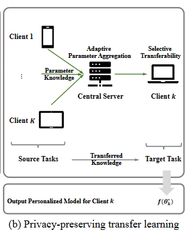

# Personalized Federated Learning with Parameter Propagation（隐私保护的迁移学习问题）

- Q: 论文是做什么的
  - 根据个性化联邦学习算法局限性，提出了一种用于个性化联邦学习的新型联邦参数传播（FEDORA）框架。将标准的个性化联邦学习重新构建为一个隐私保护的迁移学习问题，**旨在提高每个客户端的泛化性能**。（更好地适应新数据，而不会受到噪声或训练数据中的特定模式的干扰。）显着减轻个体客户端参与联邦协作时的负迁移。
  - MNIST数据集
  
- Q:什么是FEDORA模型
  - FEDORA：用于个性化联邦学习的新型联邦**参数传播**（FEDORA）框架。**关键思想**是同时学习如何传递和是否传递。从迁移学习的角度来看，客户通过利用其他客户的潜在知识来学习个性化模型。

（1）自适应参数传播：强制一个客户端根据其任务相关性（例如，通过分布相似性明确测量）自适应地将其参数传播给其他客户端，

（2）选择性正则化：每个客户端仅在其本地个性化模型的泛化性能与接收到的参数呈正相关时，才会对其本地个性化模型应用正则化。在各种联邦学习基准上进行的实验表明，所提出的FEDORA框架相对于最先进的个性化联邦学习基线具有显著的有效性。



对于每个客户端k，它认为自己是目标，其他客户端(k′ ∈ {1, · · · , k − 1, k + 1, · · · , K })为来源。目标是通过转移其他客户端的知识来提高客户端学习算法的泛化性能。当目标任务的训练样本数量有限（Q1）并且与源任务（Q1&Q2）共享相似的数据分布时，目标任务可以从迁移学习中受益。

更具体地说，一方面，当目标客户端的训练样本有限并且存在共享相似数据分布的其他客户端时，目标客户端就会被激励参与联合协作。更具体地说，一方面，当目标客户端的训练样本有限并且存在共享相似数据分布的其他客户端时，目标客户端就会被激励参与联合协作。如果客户端之间的分布变化很大，那么来自源客户端的转移知识将对目标学习者产生负面影响。

- Q: 为了什么而做

为了解决传统个性化联邦学习存在的问题，从隐私保护的迁移学习角度深入探讨了个性化联邦学习，旨在提高每个客户端的泛化性能。

1. 以前的工作在更多关注所有客户端的整体性能时，某些客户端可能面临负面的知识传递问题(负迁移）。
2. 需要高昂的通信成本来明确学习客户端之间的统计任务相关性。
3. 将从有经验的客户端学到的知识推广到新客户端在计算上是昂贵的。

- 什么是负知识迁移？
  - 在机器学习和联邦学习等领域中，从一个任务或模型迁移到另一个任务或模型时，性能不是提高而是降低的现象。通常发生在模型尝试从不相关或质量较差的数据中学习时，或者当模型从一个任务上获得的知识不适用于另一个任务时。在联邦学习环境中，当不同客户端的数据分布差异很大时，这种现象尤其明显。

- Q: 有何优缺点

个性化联合学习的目标是通过转移其他相关客户的知识，为每个客户学习最佳的个性化模型。正如之前的工作[2,42,44]所指出的，当将知识从源任务迁移到目标任务时，迁移性能与任务之间的分布差异和目标任务中的训练样本数量密切相关。

- 在审查了"Wu et al. 2023"的论文后，我发现FEDORA框架的一些局限性可能包括：

  1. **分布相似性测量的准确性**: 在不同客户端之间准确测量分布相似性可能具有挑战性。这对于确保参数传播的有效性至关重要。

  2. **动态客户端参与处理**: 随着时间的推移，客户端可能会动态地加入或离开联邦学习网络。FEDORA框架需要有效方法来应对这种动态性。

  3. **可扩展性和健壮性**: 在各种真实世界场景中确保框架的可扩展性和健壮性可能是一个挑战，尤其是在面对大量异构数据和不同类型的客户端时。

  4. **通信成本和计算开销**: 尽管FEDORA旨在减少通信成本和计算开销，但在大规模部署时这些因素可能仍然是限制因素。

  这些局限性指出了未来改进和研究的方向。

- Q: 解决了什么挑战
  - 克服先前算法面临的负面知识可转移性问题
  - 降低沟通成本，提高个性化联合学习流程的整体效率

- Q:**FEDORA 如何引入自适应参数传播？**
  - 它强制一个客户端根据其任务相关性将其参数自适应地传播给其他客户端，而任务相关性是通过分布相似度来明确衡量的。这种自适应参数传播机制有助于解决先前算法面临的负面知识转移问题。 
  - FEDORA 中自适应参数传播的目标是通过允许在客户端之间传递相关知识来提高每个客户端的泛化性能。通过考虑任务分配的相似性，FEDORA 确保有选择地将参数传播给可以从中受益的客户，从而提高个性化联邦学习过程的整体性能。 
  - 通过自适应参数传播，FEDORA 使客户能够学习彼此的经验，利用所获得的知识来改进自己的模型，从而在个性化联合学习场景中获得更好的泛化性能。
- **FEDORA 通过分布相似度来衡量任务相关性：**
  - FEDORA 通过评估客户端之间的分布相似度来衡量任务相关性。这样做是为了确定一个客户的参数应在多大程度上传播给其他客户端。 -FEDORA 中的自适应参数传播机制强制一个客户端根据其任务相关性自适应地将其参数传播给其他客户端，而任务相关性是通过分布相似度明确衡量的。 -这种自适应参数传播的目标是在客户端之间传递相关知识，提高每个客户的泛化性能。 -通过考虑任务分配的相似性，FEDORA 确保有选择地将参数传播给可以从中受益的客户，从而提高个性化联邦学习过程的整体性能。 -这种方法有助于克服先前算法面临的负面知识转移问题，使客户能够相互学习经验，从而在个性化联邦学习场景中获得更好的泛化性能 .

- Q: 现有方法是怎么做的
  - 在联邦学习方面，多个客户端在中心服务器的协调下共同训练机器学习模型，但这种方法在数据分布异质性的情况下可能无法为所有客户端提供良好的泛化。
  - 个性化联邦学习应运而生，目的是为每个独立客户端学习一个个性化模型，包括多任务学习方法、元学习、定制化正则化、部分参数共享等。

- Q: 作者的核心贡献（典型三段式）

- 论文通过在各种联邦学习基准上的实验，展示了 FEDORA 相较于现有最先进的个性化联邦学习方法的优势，并包含理论分析和广泛的实验结果来验证其方法。
- 用于减轻个性化联邦学习中的负迁移，然后进行理论收敛和泛化分析。
- FEDORA 的有效性在各种个性化联邦学习基准测试中得到了证实, 表明 FEDORA 可以有效地适应与标记或未标记训练样本相关的新客户端。

- 如何理解这个代码

  ClientUpdate.py

```python
#LocalUpdate 和 LocalUpdateFEDORA，用于在客户端上训练模型。客户端输入包括训练数据（通过train_loader）和一个初始模型（net）。训练过程中，模型在本地数据上进行更新。输出是更新后的模型参数。
import torch
from torch import nn
import copy


class LocalUpdate(object):
    def __init__(self, args, train_loader=None):
        self.args = args
        self.train_loader = train_loader
        self.criteria = nn.CrossEntropyLoss()

    def train(self, net, device):
        net.train()
        optimizer = torch.optim.SGD(net.parameters(), lr=self.args.inner_lr, momentum=.9, weight_decay=self.args.inner_wd)

        for i in range(self.args.inner_steps):
            for images, labels in self.train_loader:
                images, labels = images.to(device), labels.to(device)

                net.zero_grad()
                log_probs = net(images)
                loss = self.criteria(log_probs, labels)
                loss.backward()
                optimizer.step()

        return net.state_dict(), len(self.train_loader)

    def get_loss(self, net, device):
        net.eval()
        loss = 0.
        for images, labels in self.train_loader:
            images, labels = images.to(device), labels.to(device)
            log_probs = net(images)
            loss += self.criteria(log_probs, labels)
        return loss


class LocalUpdateFEDORA(object):
    def __init__(self, args, train_loader=None, val_loader=None):
        self.args = args
        self.train_loader = train_loader
        self.val_loader = val_loader
        self.criteria = nn.CrossEntropyLoss()

    def train(self, net, device, w_fedora=None, lam=1):
        net.train()
        optimizer = torch.optim.SGD(net.parameters(), lr=self.args.inner_lr, momentum=.9, weight_decay=self.args.inner_wd)

        for i in range(self.args.inner_steps):
            for images, labels in self.train_loader:
                images, labels = images.to(device), labels.to(device)
                w_0 = copy.deepcopy(net.state_dict())

                log_probs = net(images)
                loss = self.criteria(log_probs, labels)
                optimizer.zero_grad()
                loss.backward()
                optimizer.step()

                if w_fedora is not None:
                    w_net = copy.deepcopy(net.state_dict())
                    for key in w_net.keys():
                        w_net[key] = w_net[key] - self.args.inner_lr * lam * (w_0[key] - w_fedora[key])
                    net.load_state_dict(w_net)
                    optimizer.zero_grad()

        return net.state_dict(), len(self.train_loader)

    def get_loss(self, net, device):
        net.eval()
        loss = 0.
        for images, labels in self.val_loader:
            images, labels = images.to(device), labels.to(device)
            log_probs = net(images)
            loss += self.criteria(log_probs, labels)
        return loss


```

network.py

```python
#定义了几种神经网络模型的结构，如 MLPMnist, MLPHyper, CNN 和 CNNHyper。这些模型用于在不同类型的数据集上进行训练（如MNIST或图像数据集）。输入是数据样本，输出是模型的预测结果。
from collections import OrderedDict
import torch.nn.functional as F
from torch import nn
from torch.nn.utils import spectral_norm


class MLPMnist(nn.Module):
    def __init__(self, dim_in=28*28, dim_hidden=128, out_dim=10):
        super(MLPMnist, self).__init__()
        self.layer_input = nn.Linear(dim_in, dim_hidden)
        self.relu = nn.ReLU()
        self.layer_hidden = nn.Linear(dim_hidden, dim_hidden)
        self.relu2 = nn.ReLU()
        self.layer_output = nn.Linear(dim_hidden, out_dim)

        self.weight_keys = [['layer_input.weight', 'layer_input.bias'],
                            ['layer_hidden.weight', 'layer_hidden.bias'],
                            ['layer_output.weight', 'layer_output.bias']
                            ]

    def forward(self, x):
        x = x.view(-1, x.shape[1]*x.shape[-2]*x.shape[-1])
        x = self.layer_input(x)
        x = self.relu(x)
        x = self.layer_hidden(x)
        x = self.relu2(x)
        x = self.layer_output(x)
        return x


class MLPHyper(nn.Module):
    def __init__(self, n_nodes, embedding_dim, in_dim=28*28, out_dim=10, hidden_dim=100, spec_norm=False, n_hidden=1):
        super().__init__()

        self.in_dim = in_dim
        self.out_dim = out_dim
        self.embeddings = nn.Embedding(num_embeddings=n_nodes, embedding_dim=embedding_dim)

        layers = [
            spectral_norm(nn.Linear(embedding_dim, hidden_dim)) if spec_norm else nn.Linear(embedding_dim, hidden_dim),
        ]
        for _ in range(n_hidden):
            layers.append(nn.ReLU(inplace=True))
            layers.append(
                spectral_norm(nn.Linear(hidden_dim, hidden_dim)) if spec_norm else nn.Linear(hidden_dim, hidden_dim),
            )

        self.mlp = nn.Sequential(*layers)

        self.l1_weights = nn.Linear(hidden_dim, 128 * self.in_dim)
        self.l1_bias = nn.Linear(hidden_dim, 128)
        self.l2_weights = nn.Linear(hidden_dim, 128 * 128)
        self.l2_bias = nn.Linear(hidden_dim, 128)
        self.l3_weights = nn.Linear(hidden_dim, self.out_dim * 128)
        self.l3_bias = nn.Linear(hidden_dim, self.out_dim)

    def forward(self, idx):
        emd = self.embeddings(idx)
        features = self.mlp(emd)

        weights = OrderedDict({
            "layer_input.weight": self.l1_weights(features).view(128, self.in_dim),
            "layer_input.bias": self.l1_bias(features).view(-1),
            "layer_hidden.weight": self.l2_weights(features).view(128, 128),
            "layer_hidden.bias": self.l2_bias(features).view(-1),
            "layer_output.weight": self.l3_weights(features).view(self.out_dim, 128),
            "layer_output.bias": self.l3_bias(features).view(-1),
        })
        return weights


class CNN(nn.Module):
    def __init__(self, in_channels=3, n_kernels=16, out_dim=10):
        super(CNN, self).__init__()
        self.conv1 = nn.Conv2d(in_channels, n_kernels, 5)
        self.pool = nn.MaxPool2d(2, 2)
        self.conv2 = nn.Conv2d(n_kernels, 2 * n_kernels, 5)
        self.fc1 = nn.Linear(2 * n_kernels * 5 * 5, 120)
        self.fc2 = nn.Linear(120, 84)
        self.fc3 = nn.Linear(84, out_dim)

        self.weight_keys = [['fc1.weight', 'fc1.bias'],
                            ['fc2.weight', 'fc2.bias'],
                            ['fc3.weight', 'fc3.bias'],
                            ['conv2.weight', 'conv2.bias'],
                            ['conv1.weight', 'conv1.bias'],
                            ]

    def forward(self, x):
        x = self.pool(F.relu(self.conv1(x)))
        x = self.pool(F.relu(self.conv2(x)))
        x = x.view(x.shape[0], -1)
        x = F.relu(self.fc1(x))
        x = F.relu(self.fc2(x))
        x = self.fc3(x)
        return x


class CNNHyper(nn.Module):
    def __init__(self, n_nodes, embedding_dim, in_channels=3, out_dim=10, n_kernels=16, hidden_dim=100, spec_norm=False, n_hidden=1):
        super().__init__()

        self.in_channels = in_channels
        self.out_dim = out_dim
        self.n_kernels = n_kernels
        self.embeddings = nn.Embedding(num_embeddings=n_nodes, embedding_dim=embedding_dim)

        layers = [
            spectral_norm(nn.Linear(embedding_dim, hidden_dim)) if spec_norm else nn.Linear(embedding_dim, hidden_dim),
        ]
        for _ in range(n_hidden):
            layers.append(nn.ReLU(inplace=True))
            layers.append(
                spectral_norm(nn.Linear(hidden_dim, hidden_dim)) if spec_norm else nn.Linear(hidden_dim, hidden_dim),
            )

        self.mlp = nn.Sequential(*layers)

        self.c1_weights = nn.Linear(hidden_dim, self.n_kernels * self.in_channels * 5 * 5)
        self.c1_bias = nn.Linear(hidden_dim, self.n_kernels)
        self.c2_weights = nn.Linear(hidden_dim, 2 * self.n_kernels * self.n_kernels * 5 * 5)
        self.c2_bias = nn.Linear(hidden_dim, 2 * self.n_kernels)
        self.l1_weights = nn.Linear(hidden_dim, 120 * 2 * self.n_kernels * 5 * 5)
        self.l1_bias = nn.Linear(hidden_dim, 120)
        self.l2_weights = nn.Linear(hidden_dim, 84 * 120)
        self.l2_bias = nn.Linear(hidden_dim, 84)
        self.l3_weights = nn.Linear(hidden_dim, self.out_dim * 84)
        self.l3_bias = nn.Linear(hidden_dim, self.out_dim)

        if spec_norm:
            self.c1_weights = spectral_norm(self.c1_weights)
            self.c1_bias = spectral_norm(self.c1_bias)
            self.c2_weights = spectral_norm(self.c2_weights)
            self.c2_bias = spectral_norm(self.c2_bias)
            self.l1_weights = spectral_norm(self.l1_weights)
            self.l1_bias = spectral_norm(self.l1_bias)
            self.l2_weights = spectral_norm(self.l2_weights)
            self.l2_bias = spectral_norm(self.l2_bias)
            self.l3_weights = spectral_norm(self.l3_weights)
            self.l3_bias = spectral_norm(self.l3_bias)

    def forward(self, idx):
        emd = self.embeddings(idx)
        features = self.mlp(emd)

        weights = OrderedDict({
            "conv1.weight": self.c1_weights(features).view(self.n_kernels, self.in_channels, 5, 5),
            "conv1.bias": self.c1_bias(features).view(-1),
            "conv2.weight": self.c2_weights(features).view(2 * self.n_kernels, self.n_kernels, 5, 5),
            "conv2.bias": self.c2_bias(features).view(-1),
            "fc1.weight": self.l1_weights(features).view(120, 2 * self.n_kernels * 5 * 5),
            "fc1.bias": self.l1_bias(features).view(-1),
            "fc2.weight": self.l2_weights(features).view(84, 120),
            "fc2.bias": self.l2_bias(features).view(-1),
            "fc3.weight": self.l3_weights(features).view(self.out_dim, 84),
            "fc3.bias": self.l3_bias(features).view(-1),
        })
        return weights

```

serverupdate.py

```python
#在服务器端聚合不同客户端提交的模型参数。输入是来自各个客户端的模型参数和相应的数据批量大小，输出是聚合后的全局模型参数。
import copy

def ServerUpdate(w):
    num_batches = 0
    for i in range(len(w)):
        num_batches += w[i][1]
    w_avg = copy.deepcopy(w[0][0])

    for k in w_avg.keys():
        w_avg[k] = 0
        for i in range(len(w)):
            w_avg[k] += w[i][0][k] * w[i][1] / num_batches
    return w_avg
```

在`LocalUpdateFEDORA`的代码中：

- **输入**: 
  - `net`: 初始神经网络模型。
  - `train_loader`: 用于训练的数据集。
  - `w_fedora`: 来自服务器的全局模型参数，用于个性化学习。
  - `lam`: 正则化参数，用于控制个性化调整的强度。
  - `device`: 训练模型的设备（如CPU或GPU）。

- **输出**:
  - 更新后的模型参数（`net.state_dict()`）。
  - 训练数据集的长度（`len(self.train_loader)`）。

- **信息交流**:
  - 本地模型（`net`）在客户端的数据上进行训练和更新。
  - 如果提供了`w_fedora`，则根据全局模型参数和本地模型的差异对本地模型进行调整，以实现个性化学习。通过比较 `w_fedora` 和本地模型当前的参数状态，客户端模型可以有效地从全局知识中学习，同时保留对本地数据的适应性。
  - 调整包括在每个训练步骤后，根据全局模型参数和本地模型参数之间的差异以及正则化参数来更新本地模型权重。

这部分代码与论文中FEDORA概念框架相对应，论文中的个性化联邦学习不仅涉及基于本地数据的本地模型更新，还涉及从全局模型或其他个性化模型中整合知识。这种方法解决了**负知识迁移**的挑战，并为联邦学习环境中的个别客户端提供定制化。

- Q: limitaion?
  - 准确测量客户间分布相似性的潜在挑战
  - 处理动态客户参与的高效方法的需求
  - 确保 FEDORA 框架在各种现实世界场景中的可扩展性和稳健性。

- 可能应用于推荐系统，可以遵循以下步骤：

1. **数据适配**：将推荐系统的数据适配到模型中。在推荐系统中，数据通常包括用户行为、物品特征等。需要确保数据格式与模型输入兼容。

2. **模型修改**：根据推荐任务的特性对网络模型进行修改。例如，如果是电影推荐系统，可能需要将模型的输入层和输出层调整为适合处理用户评分和电影特征的格式。

3. **个性化学习**：使用FEDORA框架中的个性化学习方法，根据用户的历史行为和偏好调整模型参数，以提高推荐的准确性和相关性。

4. **联邦学习应用**：在多用户环境中，使用联邦学习允许各个客户端（例如，不同的用户或用户群体）在保持数据隐私的同时共享模型学习成果。

5. **评估与调整**：持续监控推荐系统的性能，并根据实际情况调整模型参数和学习策略。

通过这种方式，可以将FEDORA框架应用于推荐系统，既保护了用户隐私，又提高了推荐的个性化和准确性。


