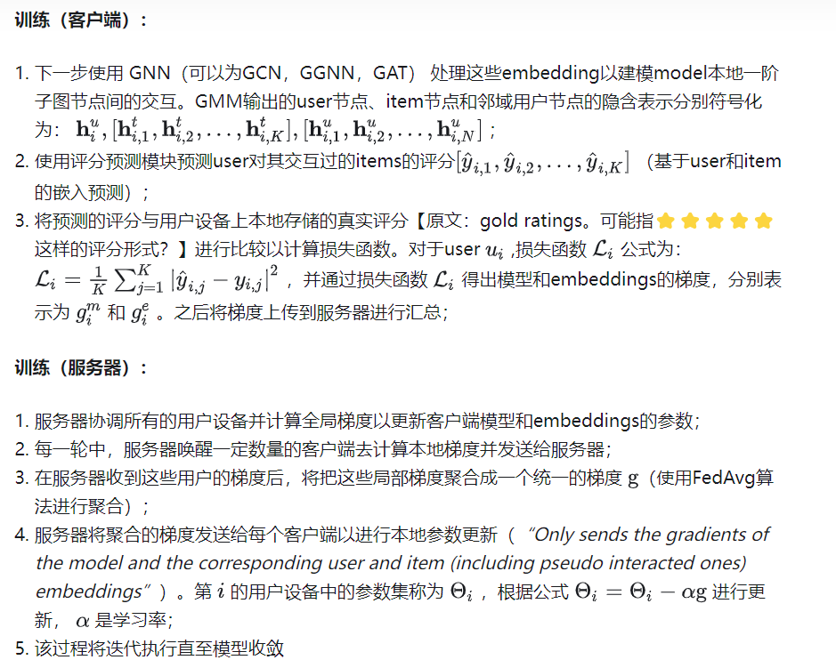

# A federated graph neural network framework for privacy-preserving personalization

## Q: 论文是做什么的，摘要第一段

- 图神经网络（GNN）能有效地**模拟高阶交互**，已被广泛应用于推荐等各种个性化应用中。
- 主流的个性化方法依赖于全局图上的集中式 GNN 学习，由于用户数据的隐私敏感性，这种方法存在相当大的隐私风险。
- 提出了一种名为 FedPerGNN 的联合 GNN 框架，用于实现有效且保护隐私的个性化。
- 通过一种保护隐私的模型更新方法，根据从本地数据中推断出的分散图协同训练 GNN 模型。
- 为了进一步利用本地交互以外的图信息，引入了隐私保护图扩展协议，在隐私保护的前提下纳入高阶信息。
- 在不同场景下对六个数据集进行个性化的实验结果表明，在良好的隐私保护下，FedPerGNN 比最先进的联合个性化方法误差低 4.0% ~ 9.6%。FedPerGNN 为以保护隐私的方式挖掘分散图数据，实现负责任的智能个性化提供了一个很有前景的方向。

## Q:什么是FedPerGNN？

通过各user设备将融合了伪交互items并经过本地差分隐私处理的模型梯度和embedding梯度上传中央服务器聚合，再将通过同态加密的item IDs和该user的embeddings上传到第三方服务器来扩展本地子图，之后将聚合梯度回传本地以进行更新，评分预测模块输出和真实评分比较计算损失......如此迭代直至模型收敛，以实现保护隐私的训练过程。


主要由一个中央服务器和大量用户客户端组成。用户客户端保留一个本地子图，该子图由用户与该用户的item和邻居的交互历史组成。每个客户端从其本地子图中学习user/item向量映射和GNN模型，并将梯度上传到中央服务器。中央服务器负责在模型学习过程中协调这些用户客户端，方法是聚合从多个用户客户端接收的梯度，并将聚合的梯度传递给它们。

FedGNN可以通过使用隐私保护下的高阶user-item交互来充分利用高度分散的用户交互数据以学习个性化的GNN模型。FedGNN的参与者包括用于协调模型学习的**学习服务器**、用于查找和分发匿名邻居信息的**第三方服务器**，以及用于协作学习GNN模型的**大量用户客户端：**

- 用户客户端保留一个本地子图，该子图由user与item的交互历史以及与该用户的有协同交互项目的邻居组成。邻居信息由定期执行的隐私保护图扩展过程提供，该过程包含一个可信的第三方服务器，以匹配加密项并分发匿名用户嵌入。每个客户端从其本地子图学习GNN模型，并将受干扰的梯度上传到中央学习服务器；
- 学习服务器负责在模型学习过程中协调这些用户客户端，方法是聚合从多个用户客户端接收的梯度并将聚合后的梯度传递回给它们。该过程进行多次迭代，直到模型收敛；
- 最后，用户设备上的用户嵌入被上传到学习服务器以提供个性化服务。通过这种方式，可以利用分散在不同客户机上的高阶信息来缓解信息隔离问题，并且可以很好地保护用户隐私。


每个客户端都在本地存储交互数据，并从中构建一阶本地子图。该图由邻居用户扩展。还从本地交互数据中采样若干伪交互项目，以隐藏真实的交互项目。邻居用户的嵌入是固定的，而中心用户的嵌入是局部更新的。项目嵌入和 GNN 梯度在上传到服务器进行聚合之前会受到扰动，聚合后的项目嵌入和 GNN 梯度会发送到客户端进行本地更新。

## Q: 为了什么而做

- 实现user-item图交互，用GNN实现个性化推荐
- 集中式GNN 学习涉及用户数据隐私敏感性，提出隐私保护。
- 严格的数据保护法规 **—>**线上平台可能无法集中存储user-item交互数据用于GNN推荐模型的学习。


## Q: 解决了什么挑战

- 对于embedding梯度，只有与user有交互的item具有非零梯度来更新其embedding，服务器可以根据非零项embedding梯度直接恢复完整的user-item交互历史;·
- 因为GNN模型梯度编码了user对item的偏好，梯度也可能泄露user历史记录和评级的隐私信息。提出伪交互项采样、LDP本地差分隐私
- 

## Q: 现有方法是怎么做的

- *”Graph convolutional matrix completion“*一文提出使用图卷积自动编码器从user-item二部图（二分图）中学习user和item表示；
- *”Neural graph collaborative filtering“*一文提出使用three-hop图注意网络来捕捉user和item间的高阶交互。
- 现有的方法中，如FedMF，将同态加密技术应用于梯度，以保护私有评级。但在这种方法中，用户设备需要在本地记忆整个item集 的embedding table，并在每次迭代时上传，以实现user交互历史保护，但由于模型训练时存储和通信成本过大，这种方法不是实际应用的最好选择。

**2.1 GNN for Recommendation**

- *Graph convolutional matrix completion*
- *Graph convolutional neural networks for web-scale recommender systems*
- *Neural graph collaborative filtering*
- *Knowledge-aware graph neural networks with label smoothness regularization for recommender systems*
- *Kgat: Knowledge graph attention network for recommendation*
- *Graph neural networks for social recommendation*

**2.2 Federated Learning**

- *Federated machine learning: Concept and applications*
- *Federated learning for mobile keyboard prediction*
- *Federated Collaborative Filtering for Privacy-Preserving Personalized Recommendation System*
- *Secure federated matrix factorization*
- *Deep Leakage from Gradients*


## Q: 作者的核心贡献（典型三段式）

1. 用户交互数据高度分散，没有全局用户项图 **—>**每个用户设备本地学习GNN模型以及user和item的向量映射（基于从该设备上的本地user-item交互数据推断出的user-item图）。用户设备计算模型和user/item向量映射的梯度，并将其上传到中央服务器，中央服务器聚合来自多个用户的梯度，并将其分发到用户设备以进行本地更新；
2. 具有非零梯度的项和GNN模型梯度都包含私有信息 **—>**提出了一种隐私保护的模型更新方法来保护用户项交互数据，而无需在模型训练期间本地存储完整的项集。将**局部差分隐私（LDP）**技术应用于用户客户端计算的局部梯度，以保护用户隐私；
3. 在上传item向量映射的梯度时保护user真正交互的item **—>**在这一过程中生成一定数量的随机抽样的**伪交互**item的随机embedding梯度；
4. 在不泄露用户隐私的情况下利用user-item图的高阶信息 **—>**提出了一种保护隐私的user-item图扩展方法，该方法旨在找到与用户具有相同交互item的邻居，并交换其向量映射以扩展其本地user-item图。通过这种方式，GNN模型可以利用user-item图的高阶信息来增强user和item的表示，并且私有user-item交互数据不会泄漏。

## Q：训练过程？




## Q：局部差分隐私LDP如何实现？

应用于用户设备本地计算的梯度，使得从这些梯度中恢复原始的user消费历史更加困难。

正常差分隐私方法，使用隐私预算。

## Q：什么是伪交互？如何实现？


## Q：图扩展方法？

1. 维护推荐服务的中央服务器首先生成一个公钥，然后分发给所有用户客户端；
2. 每个用户设备收到公钥后，根据这个密钥对互动过的items的 IDs进行**同态加密**（因为这些物品的IDs是隐私敏感的）【团队选择同态加密是因为服务器无法匹配被许多其他salt加密方法散列的items。关于salt撒盐加密，它的基本想法是：1.用户注册时，在密码上撒一些盐salt。生成一种味道，记住味道（salt+密码=hash值）；2.用户再次登陆时，在输入的密码上撒盐，闻一闻，判断是否和原来的味道相同，相同就让你吃饭】；
3. 加密后的item IDs和该user的向量映射embeddings会上传到一个第三方服务器（不需要是信任的）；
4. 该服务器通过item (ID)匹配找到与交互过相同items的user；
5. 然后向每个user提供其匿名邻居的embeddings。在这个阶段，负责推荐的服务器永远不会收到user的隐私信息，而第三方服务器由于无法解密item IDs也无法获得任何关于users和items的私密信息（前提是假设这两个服务器间不互相勾结）。

团队通过将每个user节点和与其邻居user节点连接起来【注意：邻居user节点并没有和共同交互的items相连接，这是为了在拜占庭攻击下更好的保护用户隐私。拜占庭攻击是指通信网络中攻击者控制若干授权节点并且任意干扰或破坏网络的攻击方式。（此处是指分布式学习场景下，由于拜占庭攻击，若连接items，则一个客户端遭到攻击可能导致其他客户端的隐私泄露？）】，在不损害用户隐私保护的情况下，通过高阶user-item交互来丰富本地user-item图。

## Q：同态加密？

使用RSA同态加密，满足乘法同态的部分同态加密算法。

## Q：4个方面保护隐私


## Q: 有何优缺点

## 如何理解这个代码

```

```

结论：输入是，输出是，做了什么，做了信息交流

*找模型limitations可以问gpt*

*找缺点，如何解决可能为创新点？*

*experiment不用特别仔细看*