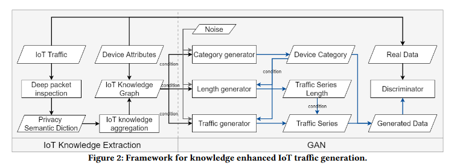
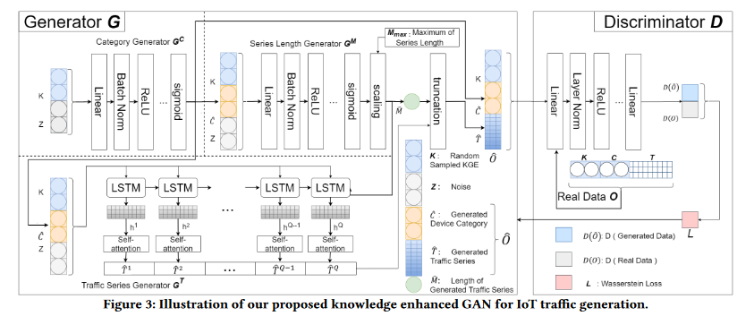

# Knowledge Enhanced GAN for IoT Traffic Generation

## Q: 论文是做什么的，摘要第一段

- 网络流量数据有助于了解物联网 (IoT) 行为并提高现实世界中的物联网服务质量。然而，大规模的物联网流量数据很少可访问，隐私问题也阻碍了现实的数据共享，即使是匿名的个人身份信息。研究人员建议生成合成物联网流量，但未能涵盖广泛的现实世界物联网设备提供的多种服务。
- 通过知识增强的生成对抗网络（GAN）框架生成大规模物联网流量，该框架引入了语义知识（例如位置和环境信息）和各种网络结构知识。
- 通过知识图的物联网设备。我们使用条件机制来合并物联网流量生成的知识和设备类别。
- 采用 LSTM 和自注意力机制来捕获流量序列中的时间相关性。

## Q：模型架构？



- 黑色、蓝色和灰色的线分别代表真实数据、生成数据和噪声的传输。
- 根据物联网设备的基本信息和网络流量构建知识图谱，并提取每个设备的KGE信息。

- 在 KGE 信息的条件下训练生成器 G 和判别器 D。生成器G由三个子生成器组成：类别生成器GC、序列长度生成器GM和流量序列生成器GT，它们通过条件机制相互关联。
- 物联网设备被视为知识图谱中的头实体，用户、平台、位置和环境信息被视为尾实体。



这张图片展示了一个为物联网（IoT）流量生成设计的知识增强生成对抗网络（GAN）的架构。这个网络包括一个复杂的生成器 \( G \) 和一个判别器 \( D \)，它们的结构被设计来处理特定于IoT流量数据的特点。下面是对这个架构的详细解释：

### 生成器 \( G \)
生成器 \( G \) 分为三个主要部分：

1. **类别生成器 \( g^C \)**:
   - 接收噪声向量 \( Z \) 和随机采样的知识图谱嵌入 \( K \)。
   - 经过一个线性层和ReLU激活函数后，数据被BatchNorm标准化。
   - 通过一个简化层产生类别 \( C' \)，这可能是IoT设备的类型。

2. **序列长度生成器 \( g^M \)**:
   - 同样接收噪声向量 \( Z \) 和知识图谱嵌入 \( K \)。
   - 数据流经线性层、ReLU激活和BatchNorm。
   - 通过一个简化层产生序列长度 \( M' \)，代表生成的流量序列的长度，不超过最大长度 \( M_{max} \)。

3. **流量序列生成器 \( g^T \)**:
   - 结合类别 \( C' \)、噪声 \( Z \) 和LSTM（长短期记忆网络）的隐藏状态来生成流量序列。
   - LSTM的每一个时间步可能会使用自注意力机制来增强特定时间点的特征。
   - 最终生成流量序列 \( T' \)。

### 判别器 \( D \)
- 它接收真实IoT流量数据或生成器产生的数据。
- 数据通过线性层和ReLU激活函数。
- 最终通过一个线性层得到判别结果 \( D(x) \) 或 \( D(G(z)) \)。

### 损失函数 \( L \)
- 这个系统使用Wasserstein损失来训练判别器，这是GAN变种WGAN使用的一种损失函数，有助于改善训练过程的稳定性。

整个系统的目的是生成看起来像真实IoT流量的数据，这对于测试网络安全系统、数据隐私保护措施等方面可能非常有用。这种类型的GAN通过在生成过程中融合领域知识（例如IoT设备的类型和通信模式）来提高生成数据的真实性。

## Q：什么是batchnorm？

`Batch Normalization`（批量归一化），通常缩写为`BatchNorm`，是一种在深度神经网络中广泛使用的技术，用于加速训练过程并提高模型在测试时的稳定性。它由 Sergey Ioffe 和 Christian Szegedy 在 2015 年提出。其基本思想是在网络的每一层输入数据前，对小批量数据进行归一化处理，使其均值为0，标准差为1，即执行以下操作：

1. **计算小批量的均值**：
$$\mu_B = \frac{1}{m} \sum_{i=1}^{m} x_i $$
其中 \( m \) 是批量大小，\( x_i \) 是批量中的第 \( i \) 个输入。

2. **计算小批量的方差**：
$$ \sigma_B^2 = \frac{1}{m} \sum_{i=1}^{m} (x_i - \mu_B)^2 $$

3. **归一化**：
$$ \hat{x}_i = \frac{x_i - \mu_B}{\sqrt{\sigma_B^2 + \epsilon}} $$
这里 \( \epsilon \) 是一个很小的数，以避免除以零。

4. **缩放和平移（重新参数化）**：
$$ y_i = \gamma \hat{x}_i + \beta $$
其中 \( \gamma \) 和 \( \beta \) 是可学习的参数，它们允许网络学习恢复原始数据的比例和平均值，如果这对于解决任务是有用的。

这个过程可以帮助缓解所谓的`内部协变量偏移`问题，这是指由于网络参数更新导致网络深层的输入分布发生变化，从而影响学习过程的现象。

BatchNorm有以下好处：

- **允许更高的学习速率**：由于它有助于稳定学习过程，可以使用更高的学习速率而不会导致模型发散。
- **减少对初始化的依赖**：由于归一化的作用，模型对权重初始化不那么敏感。
- **抑制梯度消失/爆炸**：通过归一化，可以防止梯度在网络中传播时的数值稳定性问题。
- **起到轻微的正则化效果**：每个小批量的均值和方差的估计引入了噪声，这类似于正则化，可以帮助减轻模型过拟合。

BatchNorm通常在深度网络中的每个卷积层后或全连接层前应用。在使用像ReLU这样的非线性激活函数之前应用BatchNorm通常效果最佳。

## Q：GAN原理？

GANs 是深度学习中一种非常流行的模型，通常用于生成数据，尤其是图像。这种模型包括两部分：一个生成器 $G_{\theta}$和一个判别器$D_{\phi}$。生成器的目标是生成看起来像真实数据分布的假数据，而判别器的目标是区分真实数据和生成器产生的假数据。

这里描述的是GANs的基本思想和它的目标函数，即它们是如何训练的。生成器和判别器是通过交替训练来提高性能的，其中生成器试图欺骗判别器，而判别器试图变得更擅长于识别真实与假的数据。

数学方程式部分，给出了一个最小最大（min-max）游戏，它是GAN训练过程中优化的目标。方程表达的是：$$\min_{\theta} \max_{\phi} \mathbb{E}_{x \sim p_{d}} [\log D_{\phi}(x)] + \mathbb{E}_{z \sim p_{z}} [\log (1 - D_{\phi}(G_{\theta}(z)))]$$

其中：

- \( x \) 表示真实数据样本。
- \( p_{d} \) 是真实数据的分布。
- \( G_{\theta} \) 是生成器，用参数 \( \theta \) 表示。
- \( D_{\phi} \) 是判别器，用参数 \( \phi \) 表示。

第一项$ \mathbb{E}_{x \sim p_{d}} [\log D_{\phi}(x)] $表示判别器 \( D_{\phi} \) 在真实数据上的预测对数似然，判别器试图将其最大化，使得对于真实数据 \( x \)，\( D_{\phi}(x) \) 接近于1。

第二项 $\mathbb{E}_{z \sim p_{z}} [\log (1 - D_{\phi}(G_{\theta}(z)))] $表示对于通过生成器 \( G_{\theta} \) 生成的假数据，判别器 \( D_{\phi} \) 试图最小化这些假数据被识别为真的概率。

文本最后提到，不同的GANs架构和损失函数可以被构建用于不同的生成任务，而作者们设计了一个特定的框架用于物联网（IoT）流量数据生成。

## Q:GAN实现？

```python
import torch
import torch.nn as nn
import torch.optim as optim

# 定义生成器G
class Generator(nn.Module):
    def __init__(self, input_size, hidden_size, output_size):
        super(Generator, self).__init__()
        self.main = nn.Sequential(
            nn.Linear(input_size, hidden_size),
            nn.ReLU(),
            nn.Linear(hidden_size, output_size),
            nn.Tanh()
        )

    def forward(self, x):
        return self.main(x)

# 定义判别器D
class Discriminator(nn.Module):
    def __init__(self, input_size, hidden_size, output_size):
        super(Discriminator, self).__init__()
        self.main = nn.Sequential(
            nn.Linear(input_size, hidden_size),
            nn.LeakyReLU(0.2),
            nn.Linear(hidden_size, output_size),
            nn.Sigmoid()
        )

    def forward(self, x):
        return self.main(x)

# 创建模型的参数
z_dim = 100  # 隐空间向量的维度，即生成器的输入
m = 28 * 28  # 真实数据的维度，例如对于MNIST图片是28x28
g_hidden = 256
d_hidden = 256
minibatch_size = 64

# 实例化模型
G = Generator(input_size=z_dim, hidden_size=g_hidden, output_size=m)
D = Discriminator(input_size=m, hidden_size=d_hidden, output_size=1)

# 为两个网络定义优化器
lr = 0.0002
G_optimizer = optim.Adam(G.parameters(), lr=lr)
D_optimizer = optim.Adam(D.parameters(), lr=lr)

# 损失函数
criterion = nn.BCELoss()

# 训练过程
num_epochs = 100  # 训练的轮数
for epoch in range(num_epochs):
    for batch in data_loader:  # 假设data_loader是加载数据的迭代器
        # 1. 训练判别器D
        D.zero_grad()

        # 使用真实数据
        real_data = batch[0].view(-1, m)  # 调整数据形状
        real_labels = torch.ones(minibatch_size, 1)
        real_output = D(real_data)
        D_real_loss = criterion(real_output, real_labels)

        # 使用生成的假数据
        z = torch.randn(minibatch_size, z_dim)
        fake_data = G(z)
        fake_labels = torch.zeros(minibatch_size, 1)
        fake_output = D(fake_data.detach())
        D_fake_loss = criterion(fake_output, fake_labels)

        # 反向传播和优化
        D_loss = D_real_loss + D_fake_loss
        D_loss.backward()
        D_optimizer.step()

        # 2. 训练生成器G
        G.zero_grad()

        z = torch.randn(minibatch_size, z_dim)
        fake_data = G(z)
        output = D(fake_data)
        G_loss = criterion(output, real_labels)  # 我们希望生成器的生成结果被判别器判定为真

        # 反向传播和优化
        G_loss.backward()
        G_optimizer.step()

    # 打印损失或保存生成的图片等
    print(f'Epoch [{epoch+1}/{num_epochs}], D_loss: {D_loss.item()}, G_loss: {G_loss.item()}')

```

## Q:WGAN?

WGAN代表Wasserstein Generative Adversarial Network，是一种生成对抗网络的变体，由Martin Arjovsky、Soumith Chintala和Léon Bottou在2017年提出。WGAN通过使用Wasserstein距离（又称Earth-Mover距离）作为损失函数来解决传统GAN训练中的一些问题。

在传统的GAN中，生成器和判别器通常通过最小化交叉熵损失来进行训练，这有时会导致两个主要问题：

1. **模式崩溃（Mode Collapse）**：生成器开始生成极少数的样本类型，忽略了数据的多样性。

2. **训练不稳定**：当生成器和判别器的训练不同步时，可能会导致训练过程非常不稳定。

WGAN通过采用Wasserstein距离改善了这些问题，这种距离衡量两个概率分布间的“最小移动成本”，在直观上可以理解为将一个分布变成另一个分布所需要的“工作量”。WGAN的主要优势包括：

- **改进的训练稳定性**：Wasserstein距离为梯度提供了更有用的信息，这使得WGAN在训练时更加稳定。
- **减少模式崩溃**：由于Wasserstein距离的特性，WGAN减少了模式崩溃的发生，生成的样本具有更高的多样性。
- **损失函数与图像质量之间的关系更明确**：在WGAN中，损失值通常与生成图像的质量直接相关，这意味着损失值可以作为图像质量的一个更好的指标。

WGAN的关键技术之一是“权重剪切（weight clipping）”，它限制了判别器权重的范围，以确保满足Wasserstein距离的数学要求。然而，权重剪切本身可能会引入训练问题，导致梯度消失或爆炸。为了解决这个问题，后续的研究提出了WGAN-GP（Wasserstein GAN with Gradient Penalty），它通过向损失函数中添加梯度惩罚项来代替权重剪切，有效地改进了原始WGAN的性能。

要将GAN示例代码修改为Wasserstein GAN（WGAN），我们需要做以下几个关键的改变：

1. **移除判别器中的Sigmoid激活函数**：在WGAN中，判别器（在WGAN中通常被称为批评者（critic））不再输出一个概率，而是输出一个无界的评分。

2. **修改损失函数**：不再使用二元交叉熵损失（BCELoss），而是使用判别器输出的差值作为损失。

3. **使用权重剪切或梯度惩罚来满足利普希茨约束**：在这个示例中，我将展示权重剪切，尽管梯度惩罚（如在WGAN-GP中）是更受推荐的方法。

4. **更新策略**：对批评者进行多次更新，每次生成器更新一次。

下面是代码的改动：

```python
# ... （之前的代码保持不变，包括类的定义和实例化模型）

# WGAN中不使用sigmoid激活函数于判别器中
class Discriminator(nn.Module):
    def __init__(self, input_size, hidden_size):
        super(Discriminator, self).__init__()
        self.main = nn.Sequential(
            nn.Linear(input_size, hidden_size),
            nn.LeakyReLU(0.2),
            nn.Linear(hidden_size, hidden_size),
            nn.LeakyReLU(0.2),
            nn.Linear(hidden_size, 1),
            # 注意：没有Sigmoid激活
        )

    def forward(self, x):
        return self.main(x).view(-1)

# ... （之前的代码保持不变，包括实例化模型）

# WGAN使用的损失函数简化为计算评分差
def wasserstein_loss(output, labels):
    return torch.mean(labels * output)

# 为两个网络定义优化器（优化器可以保持不变）
# ...

# 权重剪切的值，通常设置在一个很小的范围内，如 [-0.01, 0.01]
clip_value = 0.01
n_critic = 5  # 每进行一次生成器的更新之前，批评者的更新次数

# 训练过程
# ...
for epoch in range(num_epochs):
    for i, batch in enumerate(data_loader):
        
        # 训练批评者（判别器）
        for _ in range(n_critic):
            D.zero_grad()
            real_data = batch[0].view(-1, m)
            real_loss = wasserstein_loss(D(real_data), -torch.ones(real_data.size(0)))
            
            z = torch.randn(minibatch_size, z_dim)
            fake_data = G(z).detach()  # 生成假数据并断开梯度
            fake_loss = wasserstein_loss(D(fake_data), torch.ones(fake_data.size(0)))
            
            D_loss = -(real_loss - fake_loss)  # WGAN的判别器损失是负的Wasserstein距离
            D_loss.backward()
            D_optimizer.step()
            
            # 对批评者的权重进行剪切
            for p in D.parameters():
                p.data.clamp_(-clip_value, clip_value)
        
        # 训练生成器
        G.zero_grad()
        z = torch.randn(minibatch_size, z_dim)
        G_loss = -wasserstein_loss(D(G(z)), -torch.ones(minibatch_size))  # 最小化负的判别器评分
        G_loss.backward()
        G_optimizer.step()
        
        # 每个epoch结束或一定迭代后打印损失
        if i % 50 == 0:
            print(f'Epoch [{epoch+1}/{num_epochs}], Step [{i+1}/{len(data_loader)}], D_loss: {D_loss.item()}, G_loss: {G_loss.item()}')
```

在这个改动的代码中，我们对每批数据训练批评者（判别器）5次（`n_critic`次数），然后才训练一次生成器。这有助于稳定

## Q：TransE 模型是什么？

TransE是一个用于知识图谱表示学习的模型，由Bordes等人在2013年提出。知识图谱是由大量的实体（如人、地点、组织）和它们之间的关系（如“居住于”、“工作于”、“位于”）构成的网络。TransE模型的目标是学习实体和关系在低维空间中的向量表示，使得这些表示可以很好地捕捉和复现知识图谱中的关系信息。

在TransE模型中，每个实体被表示为一个固定长度的向量，每种类型的关系也被表示为向量。TransE的核心思想是，如果存在某种关系连接两个实体，则这两个实体的向量表示与关系向量表示的总和应该接近第二个实体的向量表示。换句话说，对于每个（头实体，关系，尾实体）的事实三元组（h, r, t），TransE试图确保：

$$ \textbf{h} + \textbf{r} \approx \textbf{t} $$

其中 \(\textbf{h}\) 和 \(\textbf{t}\) 是头实体和尾实体的向量表示，\(\textbf{r}\) 是关系的向量表示。

TransE将知识图谱中的三元组（h, r, t）看作是从头实体h开始，通过关系r到达尾实体t的翻译。因此，模型的训练目标是最小化头实体和关系向量之和与尾实体向量之间的距离。对于负例（错误的事实三元组），TransE则试图最大化这个距离。

训练过程涉及到正例（正确的事实三元组）和负例的抽样，以及通过随机梯度下降（SGD）或其他优化算法来调整向量表示，使得正例的得分（即头实体和关系的和与尾实体之间的距离）最小，负例的得分最大。

TransE是一种简单而有效的知识图谱表示学习方法，它为许多后续的模型如TransH、TransR和TransD等提供了基础。尽管TransE在处理复杂关系（如一对多、多对一和多对多关系）时存在局限性，但它仍然是知识图谱嵌入领域的一个基石。

## Q:什么是知识图谱？

知识图谱是一种结构化的语义知识库，旨在存储关于实体（如人、地点、组织等）的信息及其之间的各种关系（如“是”，“属于”，“位于”等），并以图形的方式组织这些信息。在知识图谱中，实体通常表示为节点，而实体间的关系则表示为边。

### 特点
知识图谱的主要特点包括：

- **结构化表示**：通过实体和关系的图形结构，知识图谱能够以结构化的形式表示复杂的事实和概念。
- **丰富的语义**：知识图谱不仅包含实体及其属性，还包含实体间丰富的语义关系，这些关系有助于理解实体的深层含义。
- **可扩展性**：知识图谱可以通过添加更多的实体和关系不断扩展，从而不断丰富其知识库。
- **互联和融合**：知识图谱可以整合来自不同来源和领域的知识，实现知识的互联和融合。

### 应用
知识图谱被广泛应用于各种领域和场景，包括：

- **搜索引擎**：提升搜索结果的相关性和丰富度，如Google的知识图谱帮助改进搜索查询的理解和搜索结果的展示。
- **推荐系统**：通过理解用户兴趣和内容间的关系，提供更准确的内容推荐。
- **自然语言处理**：利用知识图谱中的结构化知识，提高机器理解和生成自然语言的能力。
- **问答系统**：通过解析问题并在知识图谱中查找答案，实现精准的问题回答。
- **数据集成**：将来自不同数据源的信息整合在一起，提供统一的查询接口。

### 例子
- **Google的知识图谱**：用于改善Google搜索的语义搜索能力。
- **DBpedia和Wikidata**：基于Wikipedia的开放知识图谱，提供了大量的跨领域知识。
- **Facebook的社交图谱**：连接人与人之间、人与兴趣点之间的关系。

知识图谱的构建和应用是人工智能领域的一个重要研究方向，它不仅能够促进信息的组织和检索，还能够提升机器理解和处理自然语言的能力。

## Q:什么是知识图嵌入KGE？

知识图嵌入（Knowledge Graph Embedding, KGE）是一种将知识图谱（KG）中的实体（nodes）和关系（edges）映射到低维连续向量空间的技术。通过这种方式，复杂的实体和关系可以用简单的数学操作来表示和处理，从而使得机器学习模型能够轻松地处理知识图谱中的信息。知识图嵌入旨在保留实体和关系在原始图结构中的语义关系，即使在低维空间中。

### 目的
- **提高效率**：将实体和关系嵌入到低维向量空间可以大大减少处理知识图谱所需的计算资源。
- **促进泛化**：通过学习连续的向量表示，机器学习模型可以更好地泛化到未见过的实体或关系上。
- **便于计算**：在连续的向量空间中，可以使用简单的线性代数运算（如向量加法和点乘）来模拟复杂的关系和推理过程。

### 方法
常见的知识图嵌入方法包括但不限于：
- **TransE**：将关系视为实体间向量空间中的平移，即尝试让头实体向量加上关系向量等于尾实体向量。
- **TransH**、**TransR**、**TransD**：是对TransE的改进，通过引入不同的映射和投影机制来更好地处理一对多、多对一和多对多的关系。
- **DistMult**、**ComplEx**：通过使用简单的矩阵分解和复数表示来捕捉实体和关系间的交互。
- **RotatE**：通过将关系表示为复平面上的旋转，来捕捉实体间的对称性、反对称性和传递性等特点。

### 应用
知识图嵌入被广泛应用于多种任务，包括：
- **链接预测**：预测知识图谱中缺失的实体或关系。
- **实体解析**：将文本中提到的实体映射到知识图谱中的对应实体。
- **推荐系统**：通过分析实体间的关系来提供个性化推荐。
- **问答系统**：利用知识图嵌入来理解问题并在知识图谱中寻找答案。

知识图嵌入通过将丰富的结构化知识转换为机器学习友好的格式，极大地促进了人工智能系统在理解和推理方面的能力。

## Q：什么是知识增强GAN？

将构建的知识图谱中的语义和网络结构知识整合到生成对抗网络（GAN）模型中。

## Q: 为了什么而做？

- 提出一种基于大规模现实数据的流量生成模型来模拟服务于多个场景的各种物联网设备。
- 物联网流量的生成可以看作是时间序列生成的特例，它受到物联网设备复杂的背景信息的影响，即设备类别、制造商设计、用户习惯和应用服务。一旦引入生成模型，背景信息就有助于提高数据保真度。在各种背景信息中，设备类别是物联网设备的固有属性，能够为设备的功能提供重要指示，为流量序列生成提供有力指导，且不存在隐私问题。因此，为合成数据集生成物联网设备类别和流量系列就很自然了。

## Q：相关研究工作有？

尽管一些组织通过删除个人身份信息对数据集进行匿名化，但这种简单的方法被证明容易受到许多去匿名化 (DA) 攻击 [20,41,44]。在这种情况下，生成合成物联网流量成为一个有吸引力的解决方案。生成的物联网流量无需真实的个人身份信息即可保留物联网行为特征，支持物联网和WoT应用，同时避免隐私泄露。

- Nguyen-An 等人。 [29]建议 IoTTGen 为智能家居和生物医学物联网环境生成合成流量。该模型在流量生成之前请求对每个物联网设备进行配置，其中数据包大小、端口号、有效负载和到达时间间隔作为固定参数给出，而实际上是动态的。为了动态生成物联网流量，
- Shahid 等人。 [36] 将自动编码器与生成对抗网络（GAN）相结合，生成与 Google Home Mini（智能扬声器）产生的真实流量相对应的数据包大小序列，该设备已活跃使用一周。
- 由于GAN能够与不同方式的生成器配合生成多种形式的数据，Lin等人。 [23]提出了 DoppelGANger 并生成对象的属性和特征序列，这在多个网络流量数据集上达到了最先进的结果。然而，在物联网流量的实验中，DoppelGANger生成的数据集遗漏了罕见的设备类别，该模型无法模拟在缺乏背景信息的情况下物联网流量的严重不平衡和稀疏性。

## Q: 作者的核心贡献（典型三段式）

对于物联网设备来说，背景信息既包含语义知识又包含交互关系，启发我们自然地采用知识图谱。因此，我们提出了一种用于物联网流量生成的知识增强 GAN 来应对上述挑战。首先，我们通过物联网流量数据以及从制造商、供应商和用户收集的其他背景信息构建知识图。然后，我们构建了一个 GAN 框架来同时生成物联网设备类别和流量序列，由一个综合生成器和一个简单的鉴别器组成。为了将背景知识引入框架并捕捉设备类别对流量序列的影响，我们采用了条件机制。最后，我们在现实世界的物联网流量数据集上评估了我们的知识增强型 GAN，大量的实验表明，我们的模型优于五个基线，并且通过将背景知识引入到生成过程中，在小型数据集上表现良好。

- 我们构建一个知识图来描述物联网设备的背景信息，学习语义知识和交互特征
- 我们提出了一种用于物联网流量生成的知识增强型 GAN，它使用条件机制来合并物联网流量生成的知识和设备类别，并采用 LSTM 和自注意力机制来捕获流量中的长期和短期时间相关性系列。
- 我们在现实世界的物联网流量数据集上进行了实验，我们提出的模型在数据保真度和应用方面优于其他最先进的基线。该模型还被证明可以通过在生成过程中引入背景知识来生成在小型真实数据集上训练的真实数据。

## Q：什么是去匿名化 (DA) 攻击 ？

去匿名化（De-Anonymization, DA）攻击是一种数据挖掘策略，旨在识别匿名数据集中的个人。在这种攻击中，攻击者试图找出匿名信息背后的真实身份，即使这些信息最初被设计为隐藏个人的身份。

随着隐私保护的重视，许多数据集在发布前会去除或加密个人可识别信息（如姓名、地址、电话号码等）。然而，如果匿名数据集中包含足够的间接信息（比如年龄、性别、邮编等），有时可以通过与其他非匿名数据源的交叉参考来重新识别个体。例如，如果一个人在两个不同的数据集中的年龄、性别、职业和地理位置相同，那么即使没有直接的个人识别信息，也有可能将这两个记录连接起来，识别出该人的身份。

去匿名化攻击的例子包括：

- **Netflix奖挑战去匿名化**：2006年，Netflix发布了一个匿名的电影评分数据集，以便研究者改进推荐算法。尽管数据被匿名处理，但研究者通过与互联网电影数据库（IMDb）中的非匿名评分数据比较，成功识别了个别用户。
- **社交网络去匿名化**：社交网络上的用户通常被赋予一个唯一的标识符，而他们的行为（如朋友关系、点赞、分享等）被匿名记录。通过分析这些模式，研究者可以识别个体，甚至发现他们的其他账户。

去匿名化攻击的风险提醒我们，在分享或分析数据时需要小心谨慎。数据提供者必须使用更先进的匿名化技术，并确保遵守数据保护法规，如欧盟的通用数据保护条例（GDPR）和其他地方的隐私法。同时，数据科学家和研究者在使用数据时也需要遵循道德准则和法律规定，避免未经授权的去匿名化行为。

## Q：Jensen–Shannon divergence (JSD)是什么？

- 较低的 JSD 意味着更接近真实数据的分布，这表明生成模型更好。

Jensen-Shannon散度（JSD）是一种用于测量两个概率分布相似性的方法。它是基于Kullback-Leibler散度（KLD）的，但与KLD不同的是，Jensen-Shannon散度是对称的，并且总是有界的，这使得它在实际应用中成为衡量两个分布之间差异的一个很好的选择。

Jensen-Shannon散度的定义是两个概率分布 \( P \) 和 \( Q \) 的平均Kullback-Leibler散度，相对于它们的平均分布 \( M \)，其中 \( M \) 是 \( P \) 和 \( Q \) 的平均，即 $ M = \frac{1}{2}(P + Q) $。Jensen-Shannon散度的公式如下：

$$ \text{JSD}(P \parallel Q) = \frac{1}{2} \text{KLD}(P \parallel M) + \frac{1}{2} \text{KLD}(Q \parallel M) $$

其中KLD（Kullback-Leibler散度）定义为：

$$\text{KLD}(P \parallel Q) = \sum_{x} P(x) \log \left(\frac{P(x)}{Q(x)}\right) $$

对于连续的概率分布，求和会被积分所取代。KLD衡量的是在分布 \( P \) 的假设下，分布 \( Q \) 有多么不同寻常。KLD不是对称的，也就是说，\( \text{KLD}(P \parallel Q) \) 通常不等于 \( \text{KLD}(Q \parallel P) \)，而且如果两个分布中的任何一个事件在另一个分布中的概率为零，KLD是无定义的。

Jensen-Shannon散度解决了这些问题，因为它是对称的（\( \text{JSD}(P \parallel Q) = \text{JSD}(Q \parallel P) \)），并且当 \( P \) 和 \( Q \) 有不同支持集时也是有定义的。另外，JSD的值总是在0到1之间（当以对数底2为单位时），其中0表示两个分布完全相同，1表示两个分布完全不同。

在生成对抗网络（GAN）的研究中，Jensen-Shannon散度有时用来解释GAN的目标函数。在原始的GAN设置中，判别器试图最小化真实数据和生成数据分布之间的Jensen-Shannon散度。然而，由于JSD在分布不重叠时不提供有用的梯度，这就是为什么一些GAN变种，如Wasserstein GAN（WGAN），使用其他方法来衡量分布之间的差异。

```python
import torch
import torch.nn.functional as F

def kl_divergence(p, q):

计算Kullback-Leibler散度，p和q是对应的概率分布向量

    return (p * (p / q).log()).sum()

def js_divergence(p, q):
    # 计算Jensen-Shannon散度
    m = 0.5 * (p + q)
    return 0.5 * kl_divergence(p, m) + 0.5 * kl_divergence(q, m)

假设p和q是两个概率分布，我们使用softmax函数确保它们的和为1

p = torch.softmax(torch.tensor([0.1, 0.4, 0.5]), dim=0)
q = torch.softmax(torch.tensor([0.1, 0.3, 0.6]), dim=0)

计算Jensen-Shannon散度

jsd = js_divergence(p, q).item()

print(f"The Jensen-Shannon Divergence is: {jsd}")
```

## Q: 有何优缺点？

优点：
1. **综合知识图谱信息**：模型能够从知识图谱中融合语义和网络结构知识，这有助于生成更加现实和语义丰富的IoT流量数据。

2. **考虑时间相关性**：通过引入LSTM和自注意机制，模型能够捕捉流量数据中的时间相关性，使生成的数据更具有时间序列特征。

3. **适用性**：生成的数据集可以用于模拟和分析IoT网络，有助于改进IoT系统的设计和性能评估。

4. **解决数据稀缺性问题**：对于IoT流量数据通常稀缺的情况，这种生成方法可以生成大量的合成数据，填补数据缺口。

缺点：
1. **复杂性**：论文中没有提及模型的复杂性和计算成本，复杂的模型可能需要更多的计算资源和时间来训练和生成数据。

2. **数据隐私**：生成的数据可能包含与原始数据相似的特征，这可能引发数据隐私问题，需要谨慎处理。

3. **数据一致性**：生成的数据是否与真实IoT流量数据完全一致，以及是否能够准确地捕捉复杂的IoT设备行为仍然需要验证。

4. **模型通用性**：模型的通用性和在不同IoT场景中的适用性需要进一步验证，不同场景可能需要不同的模型参数和知识图谱。

## 问GPT的知识增强gan能用在推荐系统保护用户隐私领域吗

"知识增强GAN"（Knowledge Enhanced GAN）可以在推荐系统中用于保护用户隐私的领域，但需要谨慎考虑隐私保护的方法和具体实现。以下是一些考虑因素：

**优势**：

1. **生成合成数据**：知识增强GAN可以用来生成合成的、与真实数据相似的虚拟数据。这些虚拟数据可以用于替代真实用户数据，从而降低了真实用户数据被泄露的风险。

2. **降低敏感信息暴露**：通过在生成过程中引入知识图谱等外部知识，可以减少对用户敏感信息的直接依赖，从而降低了用户数据的隐私暴露风险。

3. **数据扰动**：生成的合成数据可以经过适当的扰动，以确保不会准确地反映真实用户的行为，从而提供了一定程度的隐私保护。

**考虑因素和挑战**：

1. **数据一致性**：生成的合成数据需要与真实数据在某些方面保持一致，以便推荐系统能够有效地进行个性化推荐。然而，这也增加了数据泄露的风险。

2. **保护程度**：隐私保护的效果取决于生成数据的质量和模型的复杂性。较强的隐私保护可能需要较高的数据扰动，这可能会影响推荐系统的准确性。

3. **合规性**：在使用合成数据进行推荐之前，需要确保符合相关的隐私法规和规定，例如欧洲的通用数据保护条例（GDPR）。

4. **用户反馈**：用户对于推荐系统的个性化反馈可能受到生成的合成数据的影响，这可能需要进行额外的研究和测试。

综合考虑，知识增强GAN可以作为一种隐私保护的工具用于推荐系统中，但在实际应用中需要平衡用户隐私保护和推荐准确性之间的权衡。具体的实现和效果可能需要在特定的推荐系统和隐私要求下进行深入评估和优化。此外，合规性和用户接受度也是关键考虑因素。