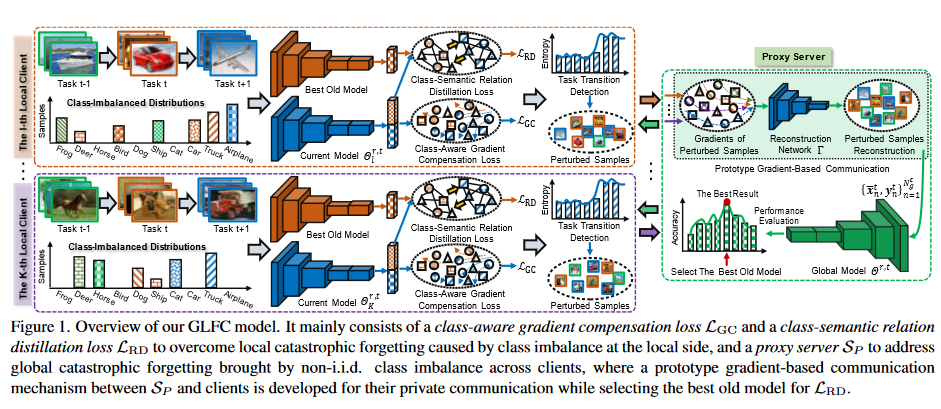

# Federated Class-Incremental Learning联邦增量学习

## Q：论文是做什么的，摘要第一段

- 为了应对本地客户端因类不平衡导致的局部遗忘，开发了一种新颖的全局局部遗忘补偿（GLFC）模型，以学习全局类增量模型，从局部和全局角度减轻灾难性遗忘。设计了类感知梯度补偿损失和类语义关系蒸馏损失，以平衡旧类的遗忘并提取跨任务一致的类间关系。
- 为了解决客户端之间的非独立同分布类不平衡带来的全局遗忘，我们提出了一个**代理服务器**，它选择最好的旧全局模型来协助局部关系蒸馏。
- 一种基于梯度的通信机制原型来保护隐私。

## Q：什么是GLFC模型?

- GLFC全局遗忘补偿

GLFC模型主要由两个部分组成：一个用于解决局部灾难性遗忘的类感知梯度补偿损失（L_GCC）和一个用于解决由客户端间类不平衡引起的全局灾难性遗忘的类语义关系蒸馏损失（L_CRD）。图中还展示了代理服务器（S_P）的角色，该服务器用于解决全局灾难性遗忘问题，并与客户端发展了一种私有通信机制，以便在选择最佳旧模型（用于L_CRD)时保护隐私。

### 模型关键部分：

1. **时间线**: 显示了不同时间点的任务（Task t-1, Task t, Task t+1）以及它们的类不平衡分布。
2. **当前模型**: 对于每个任务，都有一个当前模型（θ_t^c），它被用来学习新的类别。
3. **类感知梯度补偿损失（L_GCC）**: 这是一个设计来补偿因学习新任务而可能对旧任务造成的**遗忘**。
4. **类语义关系蒸馏损失（L_CRD）**: 用于克服局部灾难性遗忘，通过保留类间的语义关系来**提高模型的泛化能力**。
5. **代理服务器（Proxy Server）**: 负责处理来自客户端的扰动样本的梯度，并基于这些梯度重建样本，以帮助选择全局模型中的最佳旧模型。

### 工作流程：任务检测（特别）

1. **初始化与任务检测**：从第一个增量任务开始，所有客户端在每个全局轮次开始时计算其私有训练数据的平均熵，并根据iCaRL方法更新他们的示例内存。当选定的客户端通过任务转换检测策略识别出新类别时，进入下一步。

2. **扰动原型样本的构建**：识别新类别后，客户端构建这些新类别的扰动原型样本，并通过原型梯度基通信机制将相应的梯度分享给代理服务器（SP）。

3. **原型样本重建与模型选择**：代理服务器（SP）收到梯度后，重建这些原型样本，并利用它们来选择最佳的全局模型Θt，直至下次收集梯度。

4. **模型分发与更新**：从第二个任务开始，SP将上一个任务和当前任务的最佳模型（即Θt-1和Θt）分发给选定的客户端。然后，每个客户端使用Θt-1作为其本地模型Θrt进行更新。

5. **本地训练与全局聚合**：当客户端没有通过任务转换检测策略检测到新类别时，它们使用Θt-1进行本地训练；否则，它们使用Θt进行训练。最终，中央服务器（SG）聚合更新的本地模型，以获得下一轮的全局模型Θr+1t。

在GLFC模型中，模型的更新过程如下：

1. **本地客户端训练**：每个本地客户端使用其本地数据训练模型。这包括使用新数据训练新的类别，同时尝试保持旧类别的知识。

2. **生成扰动原型样本**：当本地客户端检测到新的类别时，它们会构建这些新类别的扰动原型样本。

3. **梯度编码和通信**：这些扰动原型样本的梯度被计算并通过原型梯度基通信机制发送给代理服务器SP。

4. **代理服务器处理**：SP接收来自各个客户端的梯度，执行混洗操作以保护隐私，并使用这些梯度来重建原型样本。

5. **全局模型更新**：SP利用重建的原型样本来监测全局模型的性能，并选择最佳的全局模型进行更新。

6. **分发最佳模型**：SP将选择出的最佳全局模型分发给所有客户端，以供下一轮的本地训练使用。

7. **聚合更新**：中央服务器SG聚合来自客户端的更新，形成下一轮的全局模型。

这个过程涉及到本地客户端的自主训练、梯度的保护性通信以及全局模型性能的监控和选择。通过这种方式，即使在非独立同分布(non-i.i.d.)的数据环境中，GLFC模型也能有效地更新和维护全局模型，同时缓解灾难性遗忘问题并保护数据隐私。

## Q：代理服务器SP如何解决全局灾难性遗忘问题

代理服务器 SP 在 Global-Local Forgetting Compensation (GLFC) 模型中扮演着至关重要的角色，它帮助解决了全局灾难性遗忘问题。具体来说，它的工作流程包括以下几个步骤：

1. **选择最佳的旧模型**：在训练的每一个增量任务开始时，本地客户端会检测到新的类别，并将这些新类别的扰动原型样本发送到代理服务器 SP。这些原型样本是通过一种基于原型的梯度通信机制发送的，以保持隐私。

2. **重建扰动原型样本**：代理服务器接收到这些梯度后，会重建这些扰动过的原型样本，并使用它们来监控全局模型的性能。

3. **选择全局模型**：代理服务器 SP 会利用这些重建的原型样本来选择最佳的全局模型，即选择能够最大化性能指标（如准确度）的全局模型。

4. **分发全局模型**：选择最佳的全局模型后，代理服务器将其分发给所有的本地客户端，这些客户端将其视为最佳的旧模型来执行类语义关系蒸馏损失（LRD）。

5. **隐私保护**：在整个过程中，代理服务器与客户端之间的通信是私有的，并通过添加扰动到原型样本以及基于梯度的通信来保护隐私。

通过这种机制，GLFC 模型能够在全局层面上补偿由于客户端间非独立同分布（non-i.i.d.）的类不平衡分布引起的全局灾难性遗忘，同时保持了旧类别的记忆，并在整个过程中保护了数据隐私。

代理服务器SP（Proxy Server）重建扰动原型样本的过程如下：

1. **接收梯度**：SP首先从本地客户端接收到计算出的梯度。这些梯度是基于每个客户端识别的新类别的扰动原型样本计算得出的。

2. **梯度混洗**：SP将所有接收到的梯度进行随机混洗，以构建一个梯度池。这一步骤有助于保护隐私，防止根据梯度分布追踪到特定的客户端。

3. **梯度优化**：利用接收到并混洗的梯度，SP通过优化特定的损失函数来重建原型样本。具体地，SP使用梯度信息来优化方程，进而更新和重建原型样本。

4. **样本重建**：通过上述优化过程，SP能够重建每个新类别的扰动原型样本及其标签。这些重建的样本反映了全局模型对新类别的学习和适应能力。

5. **全局模型选择和更新**：SP将这些重建的扰动原型样本输入全局模型，根据性能（如准确率）选择最佳的全局模型。然后，SP将最佳模型分发给所有客户端，供下一轮的本地训练使用。

通过这种方法，SP在不直接接触任何客户端的原始数据的情况下，有效地利用梯度信息来指导全局模型的更新和优化，同时保护了数据隐私。这个过程确保了全局模型能够持续学习和适应新类别，同时减少对旧知识的遗忘。

## Q：为什么要保持类间语义一致性？

保持类间语义一致性是为了确保模型在学习新任务时不会损害对旧任务的性能，尤其是在类增量学习场景中。当模型连续学习新的类别（或任务）时，如果不维持类间的语义一致性，模型可能会遗忘或混淆之前学习的类别的特征。这种一致性有助于模型理解和维护不同类别间的关系，即使在训练数据变得不平衡或出现新类别时也能保持性能。

在联邦学习环境下，尤其是在类增量学习（Class-Incremental Learning）中，来自各个客户端的数据可能具有不同的分布（即非独立同分布，non-i.i.d），这可能导致在不同客户端上学习到的类别之间的语义关系出现偏差。如果不进行适当的处理，这种偏差可能会在全局模型中积累，导致性能下降。

在GLFC模型中，通过引入类语义关系蒸馏损失（Class-Semantic Relation Distillation Loss），模型被训练以保持在不同增量任务间的类间语义一致性。这样做的目的是为了确保模型可以正确地理解新类别与旧类别之间的关系，并且在学习新知识的同时保留已有的知识，从而减少灾难性遗忘的风险。此外，这也有助于模型在面对类不平衡分布时更好地泛化。

## Q：SP内涉及到的混洗操作？

随机混洗形成梯度池是GLFC模型中代理服务器（SP）处理来自客户端的梯度信息的一种机制。具体操作如下：

1. 代理服务器（SP）从选定的客户端接收到梯度信息。
2. 这些梯度信息会被SP随机混洗，以构造一个梯度池（∇Γt）。这个梯度池是通过将不同客户端的梯度合并并打乱顺序形成的。
3. 混洗的目的是防止SP通过特定的梯度分布来追踪到特定的客户端，增强隐私保护。
4. 混洗后的梯度池包含了所有客户端对每个新类别选定的原型样本计算出的梯度信息，这些梯度信息被用于重建扰动原型样本并监测全局模型的性能，以选择最优的全局模型。

这一过程帮助确保了在全局模型更新和客户端隐私保护之间取得平衡。通过随机化的方式，可以减少任何可能通过梯度分析进行的个人数据泄露风险。

## Q：为了什么而做

- 灾难性遗忘
- 隐私保护
- 联邦增量学习，处理新类别数据

## Q：有何优缺点

## Q：解决了什么挑战

大多数现有方法不切实际地假设整个框架的对象类随着时间的推移而固定。它使得全局模型在现实场景中遭受对旧类的严重灾难性遗忘，其中本地客户端经常不断收集新类，并且用于存储旧类的存储内存非常有限。此外，未见过的新课程的新客户可能会参加 FL 培训，进一步加剧全局模型的灾难性遗忘。

## Q：现有方法是怎么做的

- 课堂增量学习（CIL）旨在不断学习新课程，同时解决旧课程的遗忘问题[1,19,54]。在无法访问旧类数据的情况下，[20]设计了新的调节器来平衡新类引起的有偏差的模型优化，并且[25,41]使用知识蒸馏来克服灾难性遗忘。

## Q：作者的核心贡献（典型三段式）

- 我们开发了一种新颖的全局局部遗忘补偿（GLFC）模型来解决 FCIL 问题，减轻局部和全局的灾难性遗忘。据我们所知，这是在 FL  设置中学习全局类增量模型的首次尝试。 
- 我们设计了类感知梯度补偿损失和类语义关系蒸馏损失，通过平衡旧类的遗忘并捕获跨任务一致的类间关系来解决局部遗忘问题。 
- 我们设计了一个代理服务器来选择本地客户端上最好的旧模型进行类语义关系蒸馏，以补偿全局遗忘，并且我们使用基于原型梯度的隐私机制来保护该代理服务器与客户端之间的通信。

- **GLFC模型**：开发了一种新颖的Global-Local Forgetting Compensation (GLFC) 模型来解决FCIL问题，这是首次尝试在FL设置中学习全局类增量模型，旨在从本地和全局角度减轻灾难性遗忘。
- **本地遗忘的解决方案**：设计了类感知梯度补偿损失和类语义关系蒸馏损失来解决本地遗忘问题，通过平衡旧类的遗忘和跨任务保持一致的类间关系。
- **全局遗忘的解决方案**：设计了代理服务器来选择最佳的旧模型，以便在本地客户端上进行类语义关系蒸馏，以补偿全局遗忘。此外，还开发了一种原型梯度基通信机制来保护代理服务器和客户端之间的私密通信。
- **隐私保护**：通过原型梯度基通信机制，保护了客户端间的隐私通信，同时选择最佳的旧模型来辅助本地关系蒸馏

## Q:如何理解这个代码

```
算法模型部分代码
```

结论：输入是，输出是，做了什么，做了信息交流

- 找模型limitations可以问gpt
- 找缺点，如何解决可能为创新点？
- experiment不用特别仔细看

## Q：文章如何保护隐私？

文章中通过几种关键策略来保护数据隐私：

1. **全局-局部遗忘补偿（GLFC）模型**：该模型特别设计来应对联邦学习（FL）中的类增量学习问题，同时注重隐私保护。它通过局部客户端之间的合作学习来训练一个全局模型，而不需要共享客户端的原始数据，从而保护了数据隐私。

2. **原型梯度基通信机制**：为了进一步增强隐私保护，GLFC模型引入了一种**原型梯度基通信机制**。这种机制允许局部客户端与代理服务器之间有效地交换信息，同时最小化了可能泄露的隐私信息量。具体来说，这种机制通过在交换的样本中添加扰动来保护隐私，从而使得即使攻击者能够获取到这些扰动样本，也很难从中提取出有用的信息。

3. **扰动原型样本构建**：为了防止潜在的恶意攻击者重构出原始的原型样本，提出了在原型样本上添加扰动的方法。这种方法通过在数据特征中引入高斯噪声来实现，使得即使攻击者能够某种方式获取到这些样本，也难以获得有价值的信息。这种方法的引入进一步加强了模型在保护用户隐私方面的能力。

这些策略共同构成了一个既能有效学习新类别又能保护数据隐私的联邦学习框架。

## Q：什么叫原型梯度基通信机制，如何实现的

原型梯度基通信机制（Prototype Gradient-Based Communication Mechanism）是一种旨在联邦学习（FL）环境中实现隐私保护的通信机制。它通过以下步骤实现：

1. **选择代表性样本**：当本地客户端（如某个移动设备或分布式数据源）接收到新类别的数据时，它会从这些新类别的数据中为每个新类选择一个代表性样本（称为原型样本）。这些样本被选择是因为它们的特征最接近该类中所有样本的平均嵌入，使得它们能够代表各自的类别。

2. **计算梯度**：这些选定的原型样本及其标签被输入到一个梯度编码网络（一个比训练模型浅得多的网络，用于提高通信效率）。这个网络计算每个原型样本的梯度。

3. **梯度传输**：计算得到的梯度被发送到代理服务器（Proxy Server）。这个服务器不直接接触原始数据，而是通过接收处理过的梯度来进行计算，从而保护了数据的隐私。

4. **重构与选择**：代理服务器接收到来自各个客户端的梯度后，将这些梯度用于重构扰动过的原型样本，并利用这些重构的样本来监控全局模型的性能，以选择最佳的全局模型。

5. **隐私保护**：为了进一步加强隐私保护，会对这些原型样本添加扰动，这样即使攻击者能够以某种方式重构这些样本，也很难从中提取出有价值的信息。这通过在样本的潜在特征中引入高斯噪声来实现。

## Q：如何选择代表性样本作为原型样本的

在文章中，代表性样本作为原型样本的选择是通过以下步骤完成的：

1. **识别新类别**：当本地客户端（例如，用户的设备）在某个任务（t-th task）中接收到**新类别的数据**时，它会通过任务转换检测机制来识别新的类别。

2. **选择代表性原型样本**：对于每个新识别的类别，本地客户端会从接收到的数据中选择一个代表性样本作为原型样本（`xtlc*`）。这个样本的选择基于一个准则：选取的样本特征在潜在特征空间中最接近该类所有样本的平均嵌入（mean embedding）。简言之，选择的原型样本是那些能够最好地代表其所属类别特征的样本。

3. **计算梯度并通信**：选定的原型样本及其标签被送入一个浅层的梯度编码网络（Γ = {Wi}），该网络比本地训练模型（`Θrt`）要浅，这是为了提高通信效率。在此网络中，计算原型样本的梯度（`∇Γlc`），其中Wi是网络的第i层的参数。然后，这些梯度信息被发送到代理服务器（SP），而不是原始的样本数据，从而在不泄露用户隐私数据的情况下实现模型的更新和训练。

## Q：什么叫接收新类别数据？

- 接受新类别数据在联邦类增量学习（FCIL）背景下，指的是在一个分布式的学习环境中，本地客户端（如智能手机、传感器等）收集到属于未曾见过的新类别的数据。这些新类别的数据不仅需要被模型学习，以便模型可以识别和处理这些新类别，而且还需要在不违反用户隐私的前提下进行学习。FCIL的挑战在于如何在连续接收到新类别数据的情况下，有效训练全局模型以识别这些新类别，同时减轻对旧类别的灾难性遗忘，且在此过程中保护数据隐私。

- 在FCIL设置中，本地客户端会在每个增量任务中收集训练数据，并且可能会有新的客户端加入，带来未见过的新类别数据。这些数据的分布在当前和新加入的客户端之间是非独立同分布（non-i.i.d.）的。FCIL要求这些本地客户端协作训练一个全局模型，以连续学习新类别，同时对隐私保护和有限的存储空间有所限制。

- 在实际操作中，当选定的本地客户端通过任务转换检测策略识别到新类别时，它们将构建这些新类别的扰动原型样本，并通过基于原型的梯度通信机制将相应的梯度分享给代理服务器。代理服务器在接收到这些梯度后，重建这些原型样本，并利用它们来选择最佳的全局模型，直到下一次收集梯度。这个过程中，通过在发送原型样本之前添加扰动，以及通过梯度而不是原始数据来进行通信，有助于保护数据隐私。

## Q：FCIL类似于冷启动问题吗？

接受新类别数据在联邦类增量学习（FCIL）背景下，某种程度上类似于传统机器学习和推荐系统中的冷启动问题。

冷启动问题通常指的是当系统尝试向新用户推荐物品或者向所有用户推荐新物品时遇到的挑战，因为系统缺乏足够的数据来做出准确的推荐。在FCIL的上下文中，当模型遇到新类别的数据时，由于缺乏对这些新类别的先前知识，模型需要有效地学习和适应这些新类别，这与冷启动问题中面临的挑战相似。

然而，FCIL的挑战不仅仅是如何快速适应新类别（类似于冷启动），还包括如何在不违反用户隐私的前提下进行学习，以及如何在有限的存储空间和计算资源下维持对旧类别的记忆。因此，虽然FCIL和冷启动问题都涉及到新类别的快速学习，FCIL还需要解决隐私保护、资源限制和减轻灾难性遗忘等复杂问题。

## Q：文章模型具有迁移性吗？

Global-Local Forgetting Compensation (GLFC) 模型主要设计用于解决联邦类增量学习中的问题，特别是在处理新类别数据、避免灾难性遗忘和保护数据隐私方面。尽管GLFC是为联邦学习环境下的类增量学习设计的，但其核心思想和机制可以启发解决推荐系统中的冷启动问题。

1. **处理新类别的能力**：GLFC模型通过有效地处理新类别的数据并将其整合到现有模型中，展现了其对新信息的快速适应能力。在推荐系统的冷启动问题中，这种能力可以被用来快速地学习新用户或新物品的特征，并提供精准的推荐。

2. **遗忘补偿机制**：GLFC模型的一个关键特点是能够补偿旧知识的遗忘，这对于推荐系统来说也是非常重要的。在推荐系统中，保持对旧用户或物品的有效推荐同时，迅速适应新用户或新物品的挑战，可以借鉴GLFC的遗忘补偿机制。

3. **隐私保护**：GLFC模型通过梯度基通信和数据扰动等方式保护用户数据隐私。推荐系统中也存在严重的隐私顾虑，特别是在处理敏感的用户行为数据时。GLFC中的隐私保护机制可以为开发隐私友好的推荐系统提供思路。

然而，直接迁移GLFC模型到推荐系统可能需要调整和优化，因为两个领域的数据特性、任务目标和用户交互模式存在差异。例如，推荐系统中的冷启动问题可能需要更多地关注用户偏好的建模和预测，而GLFC的设计重点在于类别的增量学习和遗忘补偿。因此，虽然GLFC提供了处理新类别、遗忘补偿和隐私保护方面的有价值思路，但在应用到推荐系统之前，可能需要根据推荐系统的具体需求和特点进行相应的调整和定制。

## Q：灾难性遗忘？

灾难性遗忘（Catastrophic Forgetting），也称为灾难性干扰，是指在连续学习过程中，神经网络在学习新任务时会忘记之前学习的任务的知识的现象。这个问题在很多基于神经网络的学习系统中都会出现，特别是在那些需要处理连续流式数据或顺序学习任务的系统中尤为明显。

在具体的机器学习和深度学习场景中，当模型被训练以适应新的数据或任务时，如果没有采取适当的措施来保留旧知识，那么模型的性能在旧任务上往往会大幅下降。这是因为神经网络倾向于优化最近的任务，而导致之前学习到的参数和特征被新的学习目标覆盖。

为了解决灾难性遗忘的问题，研究人员提出了多种策略，包括：

- **正则化方法**：通过在损失函数中添加额外的正则化项来惩罚参数的大幅变动，从而保持对旧任务的记忆。
- **重放机制**：存储旧任务的一部分数据，并在训练新任务时与新数据一起使用，以此来帮助模型保留对旧知识的记忆。
- **参数隔离**：为新任务分配新的模型参数或网络结构，同时保持对旧任务的参数不变，从而避免干扰。
- **动态架构**：动态地调整网络结构，例如通过增加新的神经元或模块来学习新任务，同时保留旧模块不变。
