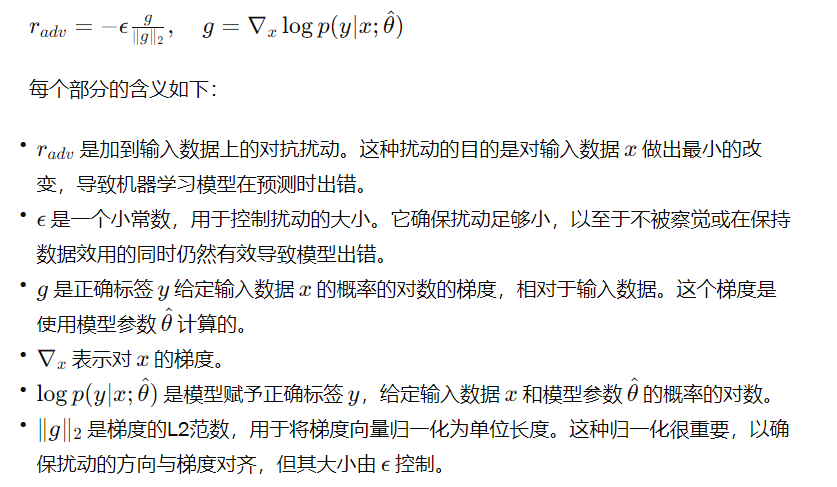

# ADVERSARIAL TRAINING METHODS FOR SEMI-SUPERVISED TEXT CLASSIFICATION

EEPrNN4.8节参考文献，学习该文献的对抗性训练方法

## Q: 论文是做什么的，摘要第一段

- 对抗训练提供了一种规范监督学习算法的方法，而虚拟对抗训练能够将监督学习算法扩展到半监督环境。这两种方法都需要对输入向量的大量条目进行小扰动，这对于稀疏高维输入（例如单热词表示）是不合适的。
- 对循环神经网络中的**词嵌入而不是原始输入本身应用扰动**，将对抗性和虚拟对抗性训练扩展到文本域。

## Q: 为了什么而做

1. 包括最先进的卷积神经网络在内的几种模型缺乏正确分类对抗性示例的能力，有时甚至当对抗性扰动被限制得非常小以至于人类观察者无法感知时也是如此。对抗性训练是训练模型以正确分类未修改示例和对抗性示例的过程。它不仅提高了对抗性示例的鲁棒性，而且还提高了原始示例的泛化性能。
2. 在训练使用监督成本的模型时，对抗性训练需要使用标签，因为标签出现在对抗性扰动旨在最大化的成本函数中。虚拟对抗训练（Miyato et al., 2016）将对抗训练的理念扩展到半监督机制和未标记的例子。这是通过对模型进行正则化来完成的，以便给定一个示例，该模型将产生与该示例的对抗性扰动产生的输出分布相同的输出分布。虚拟对抗训练对于监督和半监督学习任务都取得了良好的泛化性能。

## Q:  扰动是什么

- 扰动是有界范数。

- 通过学习具有非常大范数的嵌入来轻松地学习使扰动变得微不足道。

- 对抗性扰动（Adversarial Perturbation）是在机器学习，尤其是在深度学习领域中，对输入数据进行的一种特殊修改，旨在欺骗模型做出错误的预测或分类。这种扰动通常是微小的、人类难以察觉的变化，但却能导致模型表现出意料之外的行为。对抗性扰动的概念主要与对抗性攻击和对抗性防御相关联。

  ### 对抗性攻击
  在对抗性攻击中，攻击者通过计算对抗性扰动来生成对抗性样本，这些样本在视觉上可能与原始样本无异，但能导致深度学习模型做出错误的判断。这种攻击揭示了模型可能存在的弱点。

  ### 对抗性防御
  为了提高模型的鲁棒性，研究人员开发了多种对抗性训练技术。对抗性训练涉及在训练过程中将对抗性样本纳入训练集，迫使模型学习到在这些扰动存在的情况下仍能进行准确预测的特征。这样的训练可以增加模型对这类扰动的抵抗力。

  ### 计算对抗性扰动
  对抗性扰动通常是通过计算模型输出关于输入的梯度来获得的。例如，在图像分类任务中，通过求解模型关于输入图像的梯度，可以找到一种改变图像像素的方式，使得模型的预测结果发生变化。这种改变的目的是在不显著改变图像内容的前提下，最大化模型的预测误差。对于文本数据，对抗性扰动可能涉及对词嵌入进行微小的调整，而不是直接修改文本本身。

  对抗性扰动对于理解和提升模型的泛化能力至关重要，因为它们揭示了模型可能过于依赖的那些不稳定的特征，促使研究人员寻找更为鲁棒的训练方法。

### Q:本工作中扰动如何应用？

- 对抗性扰动应用于词嵌入，而不是直接应用于输入。
- 对抗性训练是指通过随机梯度下降最小化负对数似然加上 Ladv。

1. **公式 (1)** - **词嵌入的归一化**:
   $$
   \bar{v}_k = \frac{v_k - E(v)}{\sqrt{\text{Var}(v)}}
   $$
   其中 \(E(v) = \sum_{j=1}^{K}f_j v_j\) 为词嵌入的期望，\(\text{Var}(v) = \sum_{j=1}^{K}f_j (v_j - E(v))^2\) 为词嵌入的方差，\(f_j\) 为第 \(j\) 个词的频率。这个归一化过程确保在对抗性训练过程中产生的扰动对所有维度都是有意义的，避免模型忽略这些扰动。

2. **公式 (2)** - **对抗性扰动的定义**:
   $$
   r_{adv} = \text{arg min}_r \log p(y | x + r; \theta), \quad \text{subject to} \quad \|r\| \leq \epsilon
   $$
   这里 \(r_{adv}\) 是计算出来的对输入 \(x\) 的最优扰动，旨在最大化损失函数，从而强制模型在面对扰动时学习到更鲁棒的特征表示。

3. **公式 (3)** 和 **(4)** - **虚拟对抗性扰动**:
   $$
   r_{v-adv} = \text{arg max}_r \text{KL}[p(\cdot | x; \theta) || p(\cdot | x + r; \theta)], \quad \text{subject to} \quad \|r\| \leq \epsilon
   $$
   这些公式定义了虚拟对抗性扰动，它不依赖于标签信息，通过最大化输入 \(x\) 和扰动后的输入 \(x+r\) 的输出分布之间的KL散度，从而使模型对输入的微小变化更加鲁棒。

4. **公式 (5)** - **对抗性扰动的应用**:
   $$
   r_{adv} = -\epsilon \frac{g}{\|g\|_2}, \quad g = \nabla_x \log p(y | x; \hat{\theta})
   $$
   此公式给出了如何计算对抗性扰动 \(r_{adv}\)，其中 \(g\) 是损失函数关于输入 \(x\) 的梯度。这种扰动通过沿着模型最敏感的方向进行微调输入，增强了模型的泛化能力。

   
   
5. **公式 (6)** - **对抗性损失**:
   $$
   L_{adv}(\theta) = -\frac{1}{N} \sum_{n=1}^{N} \log p(y_n | x_n + r_{adv,n}; \theta)
   $$
   这个公式的关键在于如何通过计算损失来反映模型对于经过精心设计的扰动（即对抗性扰动 \(r_{adv}\)）的反应。这里的扰动是为了最大化模型的预测误差，迫使模型在这些扰动下仍能正确预测标签 \(y_n\)。在实际操作中：

   - \(N\) 表示数据点的数量。
   - \(x_n\) 表示第 \(n\) 个输入样本。
   - \(y_n\) 表示与 \(x_n\) 相关联的标签。
   - $r_{adv,n}$是针对 \(x_n\) 计算出的对抗性扰动，目的是最大化模型对 \(x_n\) 的预测误差。
   - \(\theta\) 代表模型的参数。
   - $p(y_n | x_n + r_{adv,n}; \theta)$表示在输入 \(x_n\) 加上扰动 \(r_{adv,n}\) 后，模型预测正确标签 \(y_n\) 的概率。
   
   通过最小化 $L_{adv}(\theta)$，模型学习在面对小的、敌意的输入扰动时保持稳定的预测，从而提高了模型的泛化能力和鲁棒性。
   
6. **公式 (7)** - **计算虚拟对抗性扰动**:
   $$
   r_{v-adv} = \epsilon \frac{g}{\|g\|_2}, \quad g = \nabla_s \text{KL} [p(\cdot | s; \hat{\theta}) || p(\cdot | s + d; \hat{\theta})]
   $$
   其中 \(d\) 是一个小的随机向量，这个公式通过计算梯度来近似虚拟对抗性扰动，使模型在未标记数据上也能提升鲁棒性。

7. **公式 (8)** - **虚拟对抗性损失**:
   $$
   L_{v-adv}(\theta) = \frac{1}{N'} \sum_{n'=1}^{N'} \text{KL} [p(\cdot | s_{n'}; \hat{\theta}) || p(\cdot | s_{n'} + r_{v-adv,n'}; \theta)]
   $$
   在这个上下文中：
   
   - \(N'\) 表示未标记数据点的数量。
   - \(s_{n'}\) 表示第 \(n'\) 个未标记的输入样本。
   - \(r_{v-adv,n'}\) 是针对 \(s_{n'}\) 计算出的虚拟对抗性扰动，旨在最大化模型输出的扰动。
   - $\text{KL}[\cdot||\cdot]$表示Kullback-Leibler散度，用于衡量两个概率分布之间的差异。
   - $p(\cdot | s_{n'}; \hat{\theta})$和 $p(\cdot | s_{n'} + r_{v-adv,n'}; \theta)$分别表示模型在未扰动输入和扰动输入上的输出分布。
   
   通过最小化虚拟对抗性损失 \(L_{v-adv}(\theta)\)，模型被训练为对小扰动保持输出的不变性，即使在没有标签信息的情况下也是如此。这种方法不仅提高了模型对已知数据的泛化能力，还增强了模型在处理未标记数据时的稳定性和鲁棒性。

## Q:KL散度是什么？

KL散度（Kullback-Leibler Divergence），也被称为相对熵，是一种衡量两个概率分布之间差异的方法。在统计学和信息论中，KL散度衡量了从概率分布 \( Q \) 近似概率分布 \( P \) 的时候引入的信息损失量。

给定两个概率分布 \( P \) 和 \( Q \)，在离散的情况下，\( P \) 和 \( Q \) 的KL散度可以通过下面的公式计算：

$$
D_{KL}(P || Q) = \sum_{i} P(i) \log \frac{P(i)}{Q(i)}
$$
在连续的情况下，公式变为积分形式：

$$
D_{KL}(P || Q) = \int_{-\infty}^{\infty} p(x) \log \frac{p(x)}{q(x)} dx
$$
这里 \( p(x) \) 和 \( q(x) \) 分别是连续随机变量的概率密度函数。

KL散度有以下几个特点：

1. **非对称性**: \( D_{KL}(P || Q) \) 不等于 \( D_{KL}(Q || P) \)。
2. **非负性**: \( D_{KL}(P || Q) \) 总是大于或等于零，当且仅当 \( P \) 和 \( Q \) 完全相同时为零。

KL散度在机器学习中有广泛的应用，尤其是在主题模型、自然语言处理和深度学习中。它可以用于训练算法中的目标函数，如变分自编码器（VAEs）中的重构损失，或者用于度量两个语言模型的相似性。它也是对抗性训练中常见的度量方式，用于测量模型输出在原始输入和对抗样本输入下的差异。

## Q: 作者的核心贡献（典型三段式）

- 仅对一个额外的超参数 ε（限制对抗性扰动大小的范数约束）进行优化就实现了这种最先进的性能。

- 鼓励将我们提出的方法用于其他文本分类任务。

- 文本分类是半监督学习的理想设置，因为有丰富的未标记语料库可供半监督学习算法利用。这项工作是我们所知的第一个使用对抗性和虚拟对抗性训练来改进文本或 RNN 模型的工作。我们还分析了训练后的模型，以定性地表征对抗性和虚拟对抗性训练的效果。我们发现对抗性和虚拟对抗性训练比基线方法改进了词嵌入。

