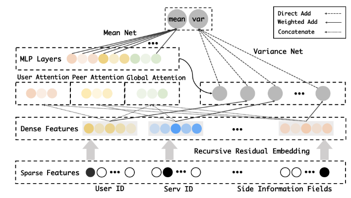
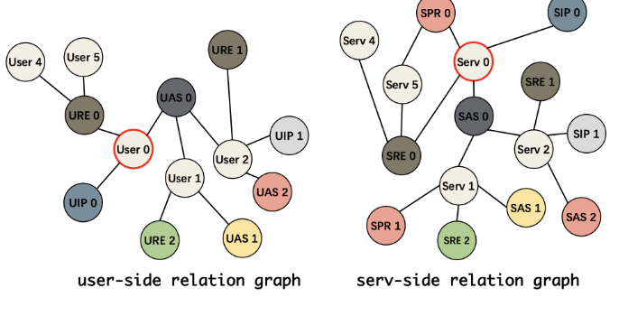
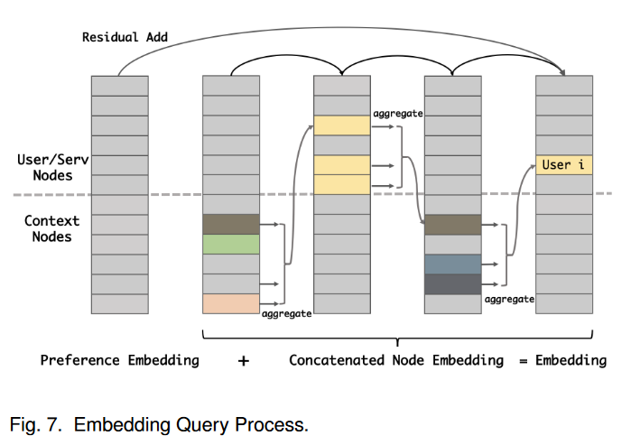
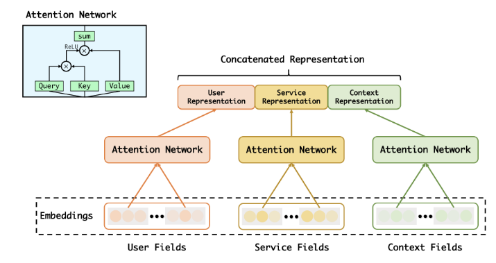
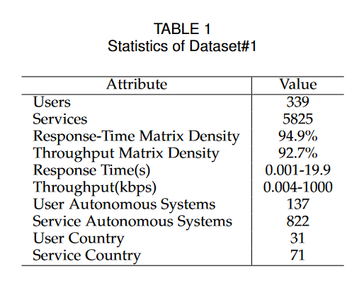

# QoS Prediction and Adversarial Attack Protection for Distributed Services Under DLaaS

提问＋解决问题

## Q: 论文是做什么的，摘要第一段

- 深度学习即服务 (DLaaS，deep-learning-as-a-service) 因其作为部署深度学习技术的图表的新颖性而受到越来越多的关注。但DLaaS仍**面临性能和安全问题**，亟待解决。考虑到有限的计算资源和利益考虑，分布式 DLaaS 系统需要服务质量 (QoS) 指标来优化性能和可靠性。
- 新的用户和服务不断加入和离开系统，导致**冷启动问题**。
- 对稳健网络连接的需求不断增长，需要模型来**评估不确定性**。
- 为了解决性能问题，我们提出了一种基于深度学习的模型，称为**嵌入增强概率神经网络**，它可以**从图结构内部提取信息并估计预测分布的均值和方差值**。
- **对抗性攻击**对 DLaaS 下的模型安全构成严重威胁。因此，我们研究了服务推荐系统的漏洞，并**提出了具有不确定性感知损失的对抗性训练**，以在噪声和对抗性环境中保护模型。在大规模现实世界 QoS 数据集上的大量实验结果验证了我们模型的稳健性和有效性。

## Q: 为了什么而做（性能+安全）

1. 冷启动问题——邻域集成，注意力机制
2. 评估不确定性——一些相似的用户可能会在某些服务上报告完全不同的QoS值，从而导致**预测值高度不确定**。概率预测，蒙特卡洛方法？
3. 研究推荐系统漏洞，提出训练方法保护模型——预测中尚未研究对抗攻击，预测可信度存在安全问题。对抗训练

## Q: 现有方法是怎么做的

- CF（不能预测何时数据稀疏）+MF应对稀疏数据问题，不能很好满足数据交互和上下文信息融合，提出使用神经网络。
- 设计了一种针对物联网环境中网络入侵检测系统的新型对抗攻击，其模型是远程部署的，只能通过网络连接访问。
- 为了提高安全服务调用，Liu 等人。 [13]应用循环神经网络来识别加密数据传输中的Web服务，从而实现进一步的流量监管和拥塞控制分析以及QoS保证。
- 曾等人。 [14]使用增强数据作为输入来帮助针对对抗性攻击进行建模，从而提高模型的安全性。
- 李等人。 [15]在组装特征空间距离和域不匹配机制之前，使用对抗策略设计和训练它们。

## Q:  EEPrNN模型是什么

- 为了解决性能+安全问题，提出了一种名为 EEPrNN 的基于深度学习的模型，给出价值预测，并且对对抗性攻击具有鲁棒性。抵御一定攻击

- 它由四部分组成：**稀疏特征输入层、递归残差嵌入层、注意力网络和任务特定层**。输入层和嵌入层负责通过查找嵌入将离散特征转换为密集向量。注意力网络用于分层学习交互和相关性。任务特定层包含 MeanNet 和 VarianceNet，分别负责输出均值和方差。方差推理网络直接接收来自嵌入和级联注意力输出的输入。总而言之，我们的模型由两个主要部分组成，**左边部分结合注意力机制用于预测平均值，右边部分用于方差估计**。与 Wide&Deep 模型[37]类似，我们采用深度网络来关注均值的隐式特征交互，并采用宽网络来关注方差。

  

  1. **Sparse Features**：这些是模型的输入特征，通常是指那些大部分值为零的特征，比如用户ID、服务ID和其他侧面信息字段。这些特征可能是类别性的，需要通过嵌入（embedding）转换成稠密的低维表示。
  
  2. **Recursive Residual Embedding**：一个用于处理稀疏特征的嵌入层，使用残差连接来增强学习能力和模型深度。残差连接有助于解决梯度消失问题，允许更深层次的网络训练。
  
  3. **Dense Features**：这些是已经被嵌入为稠密表示的特征。稠密特征是指每个特征都是有意义的，不像稀疏特征那样大部分是零。
  
  4. **MLP Layers**：多层感知器（MLP）的层，是全连接层的堆叠，用于从特征中学习非线性组合。MLP层能够捕捉复杂的特征关系。
  
  5. **User Attention & Global Attention**：这些层用于计算注意力分数，这是一种机制，模型可以用它来专注于输入特征中最重要的部分。用户注意力可能是专注于用户特定行为的模块，而全局注意力可能是在整个数据集的上下文中考虑所有信息。
  
  6. **Mean Net and Variance Net**：这两个网络可能是用来分别学习数据的均值和方差。在某些任务中，预测输出的不确定性（如方差）和预测值本身（如均值）都是很重要的。
  
  7. **Direct Add, Weighted Add, Concatenate**：这些是不同的特征融合技术。直接加法是简单的特征相加，加权加法是特征加权相加，而拼接是将特征向量放在一起形成一个更长的向量。
  
  模型通过结合注意力机制和复杂的特征处理，试图捕捉用户特征和行为模式中的细微差别。通过预测均值和方差，模型也表现出对预测不确定性的关注。

### Q:概率预测模型实现步骤

- 为基于深度学习的模型

公式(1):
$$ [\hat{Q}, \hat{\sigma}^2] = f(u_i, s_j, C_{ij}) $$
模型的输出，其中 $\hat{Q}$是预测的QoS属性，$\hat{\sigma}^2$是预测的方差。这表明模型旨在输出每个QoS属性的预测值以及预测的不确定性。

公式(2):
$$\{\theta^{(1)}, \theta^{(2)}, ..., \theta^{(k)}\} = f(u_i, s_j, C_{ij})$$
$$ \hat{Q} = \text{Monte Carlo Sample}(\{\theta^{(1)}, \theta^{(2)}, ..., \theta^{(k)}\}) $$
模型通过函数 \( f \) 预测决定QoS属性分布的参数 $\theta$，然后通过蒙特卡洛采样得到预测结果。

### 题外话：蒙特卡洛采样是啥

蒙特卡洛采样是一种统计学上的抽样方法，用于估算不确定的量。这种方法通过从概率分布中进行大量随机样本的抽取来近似复杂系统的行为或数学表达式的结果。这个名字来源于蒙特卡洛赌场，因为这种方法的本质是随机性和概率，与赌博中的随机性相似。

在机器学习和统计建模中，蒙特卡洛方法可以用于多种目的，例如：

1. **积分估算**：用于估算复杂函数在高维空间中的积分值，尤其是当传统的数值积分方法不可行时。
2. **优化问题**：寻找某些复杂函数的最大值或最小值。
3. **模拟**：模拟复杂系统的行为，比如金融市场的价格变动。
4. **预测分析**：在不确定性很高的情况下预测未来的事件或结果。
5. **概率分布**：当概率分布无法用解析形式表达或者无法直接抽样时，蒙特卡洛采样可以用来生成样本并估计分布的特征，如均值和方差。

在文章中提到的蒙特卡洛采样，指的是从预测模型得到的参数化概率分布中抽取样本以得到预测结果。例如，如果模型预测未来某一天的温度分布，蒙特卡洛采样可以用来生成一系列可能的温度值，然后通过这些样本来估计平均温度或者计算特定温度阈值被超过的概率。

### Q:**递归残差嵌入 (RREmbedding，模型关键)** 

- 构建关系图，在邻域发现的基础上，我们进一步探索新用户与边信息之间的关系，并从后者开始寻找邻域用户。
- 这一部分详细描述了关系图的构造和递归残差嵌入查询的过程。通过这种方法，可以捕获n跳（n-hop）节点的信号，并采用图卷积网络的思想进行信息聚合，优化非线性激活和正则化层。

1-hop ，直接连接节点

2-hop 跳过一个节点，辅助信息添加的确定方式

令 U = {u1, u2, u3, ..., um} 为一组用户，S = {s1, s2, s3, ..., sn} 为一组服务。对于每个 u ∈ U ，令 cui = {U AS, U RE, U IP } 为它们的用户侧上下文，其中 UAS 表示用户自治系统，URE 表示用户国籍，UIP 表示用户 IP 地址。类似地，对于服务 s ∈ S，令 csj = {SAS, SRE, SP R, SIP } 为其服务端上下文，其中 SAS、SRE、SPR、SIP 分别表示服务自治系统、区域、服务提供商和服务 IP 地址。

深度 n 意味着捕获 n-hop 节点作为邻居，而聚合器指的是我们如何聚合邻居信息。鉴于我们的关系图是反自反的，我们只选择聚合器。

- 嵌入查询

FIG7，RREmbedding 由两个嵌入矩阵参数化，即节点嵌入 EN 和偏好嵌入 EP 。为了捕获图上的 n 跳节点信号，我们借用图卷积网络 [38] 的思想来**聚合来自相邻节点的信息节点并使用非线性激活 α 和归一化层 N orm 对其进行优化**。

偏好嵌入+拼接节点嵌入=最终嵌入，residual add为残差添加

嵌入查询过程，用于从多个源头提取和组合信息来构建一个用户或服务节点的全面表示。

图中的步骤包括：

1. **用户/服务节点（User/Serv Nodes）**：这一列表示用户或服务的节点，它们是模型需要查询的主体。
   1. **上下文节点（Context Nodes）**：这一列表示与用户或服务节点相关的上下文信息，它们用于提供额外的信息以帮助构建更全面的节点表示。	

2. **偏好嵌入（Preference Embedding）**：这是用户或服务节点的原始嵌入，它反映了模型中的用户或服务的基本偏好。

3. **拼接节点嵌入（Concatenated Node Embedding）**：这一步涉及到将用户/服务节点和相关的上下文节点的嵌入进行拼接。例如，来自用户节点的嵌入和来自上下文节点的嵌入通过某种聚合方法（如加权平均）合并在一起。

4. **嵌入（Embedding）**：最终的嵌入是偏好嵌入和拼接节点嵌入的组合，通常是通过残差加法（Residual Add）实现。残差加法可以帮助防止在深层网络中信息丢失的问题，通过允许来自浅层网络的信息直接传递到深层网络。

5. **聚合（aggregate）**：这个过程表示如何将不同节点的信息聚合到一起。在这个例子中，它似乎是对不同层的嵌入进行合并，可能使用的是一种注意力机制或者简单的加权和。

公式(3)和(4):
$$\tilde{E}^{(k+1)} = (D^{-\frac{1}{2}} A D^{-\frac{1}{2}})W^{(k)}E^{(k)} + b^{(k)} $$
$$ E^{(k+1)} = \text{Norm}(\alpha(\tilde{E}^{(k+1)})) + E^{(k)} $$
这组公式描述了图神经网络的信息传递和聚合过程。$ \tilde{E}^{(k+1)} $是通过邻接矩阵 \( A \) 和度矩阵 \( D \) 调整后的嵌入，以及第 \( k \) 层的训练参数 $ W^{(k)} $和 $ b^{(k)} $。接着应用归一化层和非线性激活函数，再加上残差连接来得到下一层的嵌入 $ E^{(k+1)} $。

公式(5):
$ E_{\text{neighbor}} = \text{concat}(E^{(0)}, E^{(1)}, ..., E^{(n)}) $

通过将所有层的嵌入拼接起来形成最终的邻域嵌入 $ E_{\text{neighbor}} $。

公式(6):
$ E = E_{\text{neighbor}} + E_{(P)} $
这个公式描述了最终的嵌入 \( E \) 是由邻域嵌入 $ E_{\text{neighbor}} $和偏好嵌入 $ E_{(P)} $相加得到的。

### Q：注意力融合

公式(7):
$$ \mathbf{F_U} = [\mathbf{F_{U1}}, \mathbf{F_{U2}}, \ldots, \mathbf{F_{Uu}}] $$
$$\mathbf{F_S} = [\mathbf{F_{S1}}, \mathbf{F_{S2}}, \ldots, \mathbf{F_{Ss}}] $$
$$ \mathbf{F_C} = [\mathbf{F_{C1}}, \mathbf{F_{C2}}, \ldots, \mathbf{F_{Cc}}] $$
定义用户、服务和上下文的特征嵌入。每个特征组（用户、服务和上下文）都被转换成了 k 维的稠密嵌入向量。

通过自注意力机制捕捉特征对之间的交互，并将这些特征压缩成单一表示,以用于进一步的任务，比如推荐系统或预测模型。下面是对图中各部分的解释：

1. **Embeddings**：图的底部是三组嵌入，分别对应于用户字段、服务字段和上下文字段。这些嵌入是模型学习的低维、稠密的向量表示，它们将高维的稀疏数据（如类别ID或其他类别特征）转换为对模型更有用的形式。

2. **Attention Network**：每组嵌入后面都有一个注意力网络。这些网络通过学习输入特征的权重分布来决定哪些输入特征是更重要的，从而帮助模型更加专注于最有信息量的部分。通常，这是通过查询（Query）、键（Key）和值（Value）操作实现的，这些操作是由一个或多个神经网络层处理嵌入向量来执行的。在这里，注意力机制的输出是通过对值（Value）进行加权求和来得到的，权重由查询（Query）和键（Key）之间的相关性决定。

3. **Concatenated Representation**：来自三个不同领域的注意力网络的输出随后被拼接在一起形成一个连贯的表示。这里的拼接意味着将三个向量端对端地放在一起，形成一个更长的向量。例如，如果用户、服务和上下文表示各自是100维的，那么拼接后的表示将是300维的。

4. **Attention Network（顶部）**：在拼接的表示之上，还有一个额外的注意力网络。这个网络可能用于进一步综合和精炼这三个领域的信息，输出一个单一的向量，这个向量综合了用户、服务和上下文的所有关键信息。

公式(8):
$$ Y = \text{ReLU} \left( \frac{Q_x}{\sqrt{k}} K_x^T \right) V_x $$
这个公式是自注意力机制的计算公式，其中 \( Q_x \)、\( K_x \) 和 \( V_x \) 分别代表查询、键和值，\( Y \) 是通过这些值的加权和计算出的注意力图。

### Q：概率预测

通过分支网络预测均值和方差的方法，以此来反映预测的不确定性。整个模型的目标是输出一个预测值和一个方差，从而反映预测的不确定性。z1,为吞吐量，z2为响应时间，分数表示不确定度的贡献。

公式(9):
$$ [\hat{\mu}, \hat{\sigma}^2] = f(c_{ij}, u_i, s_j) $$
$$ \hat{\mu} = W_3 z_2 + b_3 $$
这个公式描述了模型如何计算预测的均值（$\hat{\mu}$）和方差（$\hat{\sigma}^2$），其中 \( z_1 \) 和 \( z_2 \) 是由三层感知器计算得出的中间变量。

公式(10):
$$\hat{\mu} = \mathbf{W_3} \mathbf{z_2} + \mathbf{b_3} $$
计算预测的均值（即预测值）的公式，其中 $\mathbf{z_2} $是通过三层感知器计算出的一个中间层次的表达，$\mathbf{W_3} $和 $\mathbf{b_3} $是相应的权重和偏置参数。

公式(11):
$$\sigma^2 = n W_s x_n + b_s $$
计算方差（不确定度表示），\( x_n \) 是嵌入或注意力的输入特征，\( W_s \) 和 \( b_s \) 是计算方差所需的训练参数。

### Q：多任务学习

为了充分利用多个QoS属性之间的相关性，文章复制了特定于任务的层，包括MeanNet和VarianceNet。

### Q：对抗性损失函数（重点）experiment的Q2

通过向**嵌入的不同部分添加对抗性扰动**来研究对抗性攻击下的模型。如果不对对抗性例子进行任何防御，整个模型就会被破坏。因此，有必要进行**对抗性训练**来解决这个问题。

使用了一种特殊的损失函数来估计模型参数。这个损失函数不仅包括预测误差的损失，还包括正则化项和对模型参数的惩罚。通过对抗性扰动生成对抗性样本[42]，这些对抗性样本通过在输入数据中添加小的、有意设计的扰动，这些扰动旨在误导模型做出错误的预测。新的损失函数将原有的损失函数与对抗性损失相结合，以提高模型在对抗性攻击下的鲁棒性。

  ·这样的方差不能被最小化到零，因为这会导致损失增加。

$ L = \min_{\Theta} \sum_{i=1}^{N} \left( \frac{(z_{ij} - \hat{\mu}_{ij})^2}{2\hat{\sigma}^2} + \frac{1}{2} \log \hat{\sigma}^2 \right) + \lambda ||\Theta||^2 $
原模型的损失函数，它结合了预测误差和预测方差的对数，以及模型参数的L2正则化。

1. 第一项是关于 \(N\) 个数据点的平方误差和的平均值，其中 \(z_{ij}\) 是实际观测值，\(\mu_{ij}\) 是模型预测值，\(\sigma^2\) 是预测的方差。这个项是一个典型的高斯误差模型，也称为最小二乘项，用于衡量模型预测与实际数据之间的偏差。

2. 第二项是对数似然项，其中 \(\sigma^2\) 是预测的方差。这个项对模型的不确定性进行惩罚，防止过拟合。它是正则化项的一部分，帮助在模型复杂性（如参数数量）和模型在训练数据上的表现之间取得平衡。

3. 第三项是权重衰减项，\(\lambda\) 是正则化系数，\(\| \theta \|^2\) 是参数 \(\theta\) 的欧几里得范数的平方，这是一个L2正则化项。它的目的是惩罚大的权重值，倾向于让模型参数更小，减少模型复杂度，同样防止过拟合。

综上所述，这个优化问题旨在找到使得平方误差最小、不确定性和模型复杂度得到适当控制的参数 \(\theta\)。

$$\tilde{L} = L + \lambda L(\Theta; x + \Delta r) $$
在对抗性训练中使用的损失函数，其中 $ \Delta r$是添加到输入 x 上的对抗性扰动， *λ* 是一个正则化参数，用于控制对抗性损失的强度。目的是在模型训练中包含对抗性样本，提高模型的鲁棒性。

在进行对抗性训练时，模型会在正常的数据和被添加了对抗性扰动的数据上进行训练。这样可以使模型更能够识别和抵抗那些可能在实际操作中遇到的对抗性扰动。通过这种方式，模型在面对试图扰乱预测的小变化时，能够维持其性能。

## Q：实验部分

### 数据集

WSDREAM：包含339个用户和5825个服务的QoS矩阵，并包括两个QoS属性：RT和TP。

### 数据预处理与参数设置

- 删除标记为-1的条目

- 训练集2.5%

- density：2.5%-10%，步长2.5

- 嵌入的隐藏维度：64

- 对于梯度下降算法，我们选择自适应矩估计[47]算法（Adam）。

-  MLP 的隐藏单元设置为 {256, 128, 128}。

- 初始学习率和权重衰减（L2正则化）分别设置为0.002和0.001。

- 对于训练过程，批量大小设置为 256。

### 评估指标：MAE，RMSE, MRE

## Q: 解决了什么挑战

- 有效地处理数据稀疏性
- 嵌入策略可用于邻居发现来捕获信号，以减轻极端数据稀疏情况下的低准确度。

在网络中引入更多的辅助信息可以提高预测精度。这一发现证明上下文因素包含对模型推理有用的信息。

1) 新用户加入并调用已知服务（表示为用户冷启动UCS）。 • (2) 新服务加入并已知用户调用它们（表示为服务冷启动SCS）。 （3）新用户和服务加入，新用户调用新服务（表示为Both CS），这是推荐系统的极端冷启动情况，因为只能利用辅助信息。用户侧表示主要依赖于UAS和URE。然而，服务端的注意力集中在SID列上

- 这证实深度学习技术为我们提供了强大的 QoS 预测非线性近似能力。

## Q: 作者的核心贡献（典型三段式）

- 增强嵌入。我们提出了一种新颖的递归定义方法，即**术语递归残差嵌入**，以利用 QoS 数据中的结构信息。此外，我们**通过对抗性训练增强了嵌入模块**，以**防御噪声和对抗性**攻击。这种嵌入方法在数据稀疏和攻击下是鲁棒的。研究了噪声和对抗性攻击对 QoS 预测的影响，并提出了具有不确定性感知损失的对抗性训练。

- 概率预测。提出了一种用于 QoS 值分布估计的**概率预测框架**。估计QoS值分布可以进一步适应许多下游任务，例如决策过程（例如，更稳定的服务调用体验、服务推荐系统是否应该选择具有更窄置信区间的服务等）和异常检测。 

- 广泛的实验。

## Q：limitation

- **高时间复杂度可能会阻碍所提出模型的应用**。
- 在未来的工作中通过仔细设计图操作来简化模型并优化其性能。
- 利用时间特征来形成时空感知模型，以满足在线 QoS 预测的动态特性。
- 重点关注增强可扩展性并满足大规模分布式服务推荐的行业需求。

