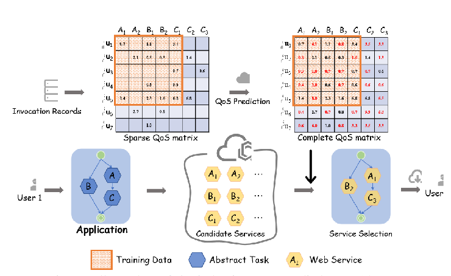
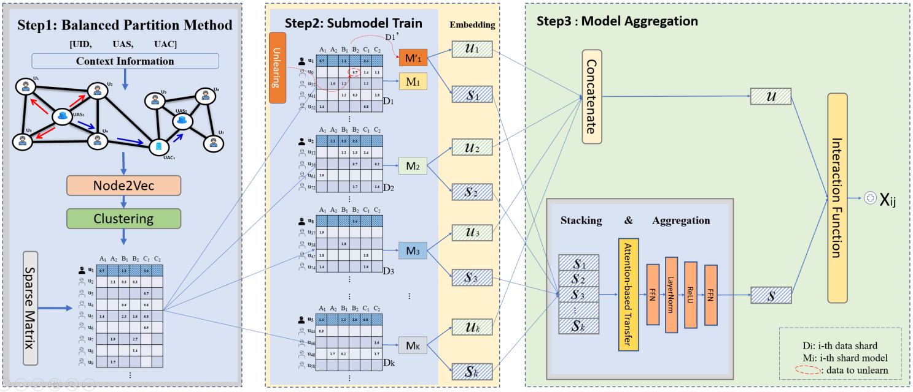
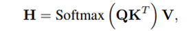
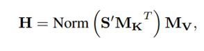
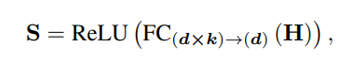

# QoSEraser: A Data Erasable Framework for Web Service QoS Prediction

注意数据集划分方式

## Q：QoS意义，重要性？

近年来，边缘云计算蓬勃发展，云服务市场也日益繁荣。
   - 功能相当的服务不断涌现，这使得为服务用户匹配优质服务成为一项挑战。
   - 基于服务质量（QoS）的协作预测模型应运而生，可为用户选择合适的边缘云服务。

## Q: 论文是做什么的？

- 提出了 QoSEraser：一种用于 QoS 预测任务的新型高效机器遗忘学习框架。 

（1）根据**上下文信息图**上随机游走引起的图嵌入的聚类结果，将训练数据划分为多个分片来训练子模型。这种划分确保了在收集的 QoS 记录中保存协作信号； 

（2）使用**级联聚合方法和基于堆叠和注意的聚合方法**将碎片嵌入中的信息自适应地压缩为均匀的嵌入。在大规模数据集上的实验表明，QoSEraser 实现了高效的遗忘学习，并且在性能方面优于最先进的遗忘方法。

关键词——协同过滤、上下文感知、机器遗忘、Web 服务、QoS 预测。

## Q:什么是遗忘学习？

机器遗忘学习（Machine Forgetting Learning）是一个相对较新的研究领域，它关注于机器学习模型中的数据遗忘问题。在机器学习和人工智能领域，模型通常被训练来记住和学习从大量数据中得到的模式和信息。然而，随着时间的推移，某些数据可能不再相关或需要从模型中删除，例如出于隐私保护的考虑。

机器遗忘学习关注于如何有效地从已训练的模型中删除特定的数据或信息，而不影响模型的整体性能。这个过程被称为“遗忘”，它需要在不完全重新训练模型的情况下移除数据的影响。这一研究方向对于处理数据隐私、遵守法律法规（如欧盟的通用数据保护条例GDPR）以及管理过时或错误数据非常重要。

机器遗忘学习的挑战在于确保模型在遗忘了特定数据或信息后，仍然能够保持原有的学习效果和准确性。这可能涉及到对模型结构或训练过程的调整，以便更灵活地处理数据的添加和删除。

## Q：为什么需要机器遗忘学习？

1. **及时删除危险数据以确保模型安全性**：在基于深度学习的服务推荐模型中，可能会不小心引入有害数据，比如带有偏见的数据或者含有误导信息的数据。如果模型能够快速且有效地遗忘这些数据，它的安全性和可靠性会得到提升。

2. **深度学习模型易受外部攻击**：深度学习模型可能面临各种类型的攻击，如对抗性攻击，这些攻击通过对输入数据进行精心设计的微小修改，使模型产生错误的输出。通过遗忘学习，模型可以从这些恶意输入中恢复过来，降低这种攻击的影响。

3. **分布外（OOD）数据处理**：分布外（Out-Of-Distribution，OOD）数据指的是那些在模型训练过程中未曾遇到的数据，这些数据可能会导致模型表现不佳。机器遗忘学习可以帮助模型忘记那些与当前数据分布不一致的过时信息，从而保持模型的准确性和鲁棒性。

4. **数据污染问题**：在数据科学和机器学习中，数据污染是指数据集中的错误、失真或不一致数据。这些数据可能会影响模型的性能和预测结果的准确性。机器遗忘学习可以应对这一问题，通过忘记或更新污染数据来维护模型的质量。

## Q：遗忘学习相关工作，缺点？

- SISA 框架会将数据随机分割成碎片和切片，每个碎片和切片都有一个模型。最终的预测结果由这些分片上的多个模型平均得出。对于碎片的每个片段，在训练过程中都会存储一个模型检查点，这样在请求删除数据样本时，只有相应的子模型会被重新训练。但是，随机分割训练集可能会破坏用户和服务之间的协作信息。
- RecEraser 是一种在推荐系统中保留协作信息的有前途的方法，它提出了三种不同的分区策略。这些策略可以实现良好的模型性能，并能有效地取消学习。不过，RecEraser 需要对历史数据进行预训练，才能根据这些数据计算相似性。在冷启动情况下，交互数据往往不可用，这就给精确划分数据带来了挑战。这就导致了次优设计和模型性能的降低，限制了整个推荐系统的有效性。

## Q:详细解释

SISA（Stochastic Iterative Sample Aggregation）框架和RecEraser。这两者都是在机器学习和数据隐私领域的概念。这两种方法在保护数据隐私和提高系统性能方面都非常关键，尤其是在涉及大量用户数据的场景中。

1. **SISA框架**：SISA是一种用于训练机器学习模型的方法，特别是在处理大规模数据集时。它的核心思想是将数据集分割成多个子集，然后迭代地对每个子集进行训练。这种方法可以减少在单次迭代中处理的数据量，从而降低内存和计算需求。SISA在训练过程中还可以提高模型的泛化能力，并有助于减少过拟合的风险。

2. **RecEraser**：RecEraser是一个关注隐私保护的工具，特别是在推荐系统中。它的目的是删除用户的历史交互数据，同时最小化这种删除对推荐系统性能的影响。这种方法对于处理用户的隐私请求特别有用，例如当用户要求“遗忘”或删除其与特定项目的互动记录时。RecEraser通过智能地调整推荐算法，确保即使在删除用户数据后，系统的性能也能保持在较高水平。

## Q: 为了什么而做

- 现有模型并未考虑许多隐私保护法规（例如通用数据保护法规（GDPR）和加州消费者隐私法 (CCPA)。
- 数据中毒攻击等安全问题，迫切需要遗忘。现有的 QoS 预测方法并未针对遗忘学习进行优化，在通过完全再训练处理遗忘学习请求时，模型可用性较低。

## Q: 解决了什么挑战

 - 在基于协同过滤的服务推荐中，最大限度地减少协同信息的损失对框架至关重要。然而，分割数据集会导致模型性能损失，因此在没有相应数据的情况下对用户相似性进行预训练具有挑战性。
 - 将数据集分割成子数据集进行子模型训练会导致不同的特征分布，从而难以共享特征并造成协作信息的丢失。减轻数据分割造成的性能下降的关键在于确保融合知识与在包含丰富协作信息的完整数据集上训练的知识之间的一致性。

## Q: 作者的核心贡献（典型三段式）

- QoSEraser框架
- 提出了平衡聚类切片法和通过上下文信息获得的节点嵌入法，将训练数据划分为多个碎片，用于子模型训练。
-  提出了一种串联、堆叠和基于注意力的聚合方法，用于从子模型中高效合成信息。
- 验证模型有效性。

## Q: 问题定义

### 矩阵

- 从采样条目中恢复未采样条目。

- 假设用户希望撤销其特定服务 s 的 QoS 记录，则需要一种未学习unlearning机制，在不包括服务记录的数据集上训练一个未学习模型。



## Q：模型框架



### 平衡数据分区，基于用户的、基于服务的

- 构建一个无向图 G，其中包括用户节点和用户上下文节点。属于同一上下文的用户连接到一个特定的上下文节点。
- 使用 Node2vec 学习图 G 中节点的特征表示。
- 采用 DCN，将基于深度学习的降维与 K 均值聚类相结合，更好地对数据进行聚类。基于服务上下文的均衡分区，通过服务嵌入计算服务的相似性。在对所有用户或服务进行聚类后，我们将用户现有的 QoS 记录按照用户或服务的类别划分为不同的数据集，其中第 i 个模型数据集。

### 串联聚合

- 在用户嵌入方面，每个子模型都会生成与子数据集相对应的用户嵌入，从而形成多样化的用户建模。然后，我们根据用户索引将用户嵌入聚合在一起，生成最终的 U。

### 堆叠和注意力聚合

- 对于服务嵌入，由于每个子模型都会对所有服务进行嵌入训练，因此我们需要将不同分区生成的嵌入合并起来，用于聚合模型。
- 为了进一步从不同的嵌入中学习特征，受 transfomer 的启发，我们可以使用相似度得分矩阵来解决这个问题。这样的学习要求使得注意力机制得以发挥。

### 模型聚合

- 根据注意力机制，学习用于聚合嵌入的权重，这表明每个嵌入贡献了多少信息：

  

- 我们将self-attention解释为在不同分区之间交换信息，使模型能够有效地选择与给定任务最相关的特征。然而，这种机制有两个主要缺点：计算相似性矩阵 $QK^T $的二次计算复杂性，以及它只考虑单一嵌入值的事实。为了缓解这些问题，我们采用了 Guo 等人提出的方法，在不计算和存储分数矩阵的情况下，以线性复杂度获取更有效的贡献。具体来说，我们学习一个矩阵 M_K 来代替乘积运算  $QK^T $以避免二次复杂度，我们学习一个值矩阵 $M_V $来代替 V。



- 计算出输出嵌入值，利用 MLP 学习不同嵌入式的最佳权重，并生成最终嵌入式 S，进一步输入交互函数，得到缺失数据的预测值。按服务对训练数据进行拆分，并应用与上述相同的流程，但将服务嵌入进行串联，并对用户嵌入进行关注聚合。   



## Q:DCN是什么

- DCN 通常指的是“深度交叉网络”（Deep & Cross Network），这是一种深度学习模型，主要用于推荐系统和广告技术中的预测建模。DCN 旨在有效捕获特征间的交叉关系，特别是那些非线性和复杂的交叉，这在传统的线性模型中很难实现。
- DCN 的核心思想是结合了深度神经网络（DNN）和特殊的交叉网络结构。深度神经网络部分负责抽象和非线性地表示特征，而交叉网络部分专门设计用于高效地模拟特征组合。交叉网络的每一层都会显式地应用特征向量间的成对交叉，从而可以捕捉到不同特征组合间的复杂关系。
- 在您描述的场景中，DCN 与 K 均值聚类结合使用，可能是为了在降维后更有效地对数据进行聚类。深度学习提供的强大特征表示能力与 K 均值聚类的简单有效性相结合，能够提高聚类的准确性和效率。特别是在处理大规模、高维度的数据时，这种组合尤为有用。例如，在推荐系统中，可以通过这种方法更准确地将用户或服务分组，以便更有效地提供个性化的服务或推荐。

### 所需库

- TensorFlow：用于构建和训练深度学习模型。
- Keras：TensorFlow 的高级 API，简化模型构建过程。
- Pandas、Numpy：用于数据处理。

### 基本步骤

1. **数据准备**：加载并预处理数据，包括归一化、编码等。
2. **构建模型**：
   - **Cross Network**：使用特殊的交叉层来自动和显式地学习特征间的交叉。
   - **Deep Network**：一个或多个密集层，用于学习高阶特征交互。
   - **结合两者**：将深度网络和交叉网络的输出合并，并连接到最终的预测层。
3. **训练模型**：使用适当的损失函数和优化器。
4. **评估和使用模型**：评估模型性能并应用于实际的推荐或预测任务。

### 示例代码

以下是一个简化的 DCN 实现示例，用 TensorFlow 和 Keras：

```python
import tensorflow as tf
from tensorflow.keras.layers import Input, Dense, Add, Multiply
from tensorflow.keras.models import Model

def build_dcn(feature_dim, num_layers=3):
    # 输入层
    inputs = Input(shape=(feature_dim,))

    # 深度部分
    deep = Dense(128, activation='relu')(inputs)
    deep = Dense(128, activation='relu')(deep)

    # 交叉部分
    cross = inputs
    for _ in range(num_layers):
        cross = Add()([Multiply()([Dense(1)(cross), inputs]), inputs])

    # 合并深度和交叉部分
    combined = Dense(1, activation='sigmoid')(Add()([deep, cross]))

    # 构建模型
    model = Model(inputs=inputs, outputs=combined)
    model.compile(optimizer='adam', loss='binary_crossentropy')

    return model

# 示例：假设我们有30个特征
model = build_dcn(feature_dim=30)

# 示例数据（X_train, y_train）和模型训练
# model.fit(X_train, y_train, epochs=10, batch_size=32)

# 模型评估或预测
# model.evaluate(X_test, y_test)
# predictions = model.predict(X_new)
```

在这个示例中，`feature_dim` 是输入特征的维度。`num_layers` 是交叉网络部分的层数。模型在交叉部分和深度部分之间学习特征交叉，然后将这些部分的输出合并以做出最终预测。

请注意，实际应用中需要根据你的特定数据和任务调整网络结构和参数。这个示例也假设了一个二分类任务（使用了 sigmoid 激活函数和 binary_crossentropy 损失函数）。对于其他类型的任务（如多分类或回归），可能需要不同的激活函数和损失函数。

## Q：node2vec是什么，如何实现

Node2vec 是一种算法，用于学习图（如社交网络、交通网络等）中节点的低维度表示。这种表示能够捕捉节点间的网络结构关系，类似于单词嵌入方法（如 Word2Vec）在文本中学习单词的表示。Node2vec 特别适合于那些需要将网络结构作为特征输入到机器学习模型中的任务。

Node2vec 的工作原理基于以下几个步骤：

1. **随机游走**：Node2vec 首先在图中进行多次随机游走，以生成节点序列。这些游走不仅仅是简单的随机游走，而是可以调整以偏向于探索图的不同方面。具体来说，它可以调整两个参数，一是返回参数 `p`，控制游走返回上一个节点的倾向，二是进出参数 `q`，控制游走探索远离源节点的倾向。

2. **学习嵌入**：然后，使用这些节点序列，类似于 Word2Vec 方法，Node2vec 使用一个优化算法（通常是随机梯度下降）来学习每个节点的向量表示。这些表示试图使共同出现在短路径上的节点在向量空间中彼此接近。

3. **使用嵌入**：一旦学习了这些嵌入，它们就可以用于各种下游任务，如节点分类、聚类或作为其他机器学习模型的输入特征。

总的来说，Node2vec 是图数据科学中一种强大的工具，能够有效地捕捉复杂网络中的结构信息，并在多种应用中提供有价值的洞察。

```
import networkx as nx
from node2vec import Node2Vec
from gensim.models import Word2Vec

# 创建一个简单的图
G = nx.fast_gnp_random_graph(n=100, p=0.5)

# 初始化 Node2Vec 模型
node2vec = Node2Vec(G, dimensions=64, walk_length=30, num_walks=200, workers=4)

# 训练模型
model = node2vec.fit(window=10, min_count=1, batch_words=4)

# 获取节点嵌入
node_embeddings = model.wv

# 使用嵌入 (例如，获取节点 '2' 的嵌入)
embedding_of_node_2 = node_embeddings['2']

```


## Q：模型训练步骤

1. **Step1: Train submodels.**
   这一步提到了训练子模型，使用了一个数学公式来表达这个过程：
   $$
   L_i(W_i | u_i, s_j) = L(f_{\theta_i}(W_i | u_i, s_j)) + \lambda_i||W_i||^2
   $$
   公式中 \(L_i\) 代表第 \(i\) 个子模型的损失函数，\(W_i\) 代表第 \(i\) 个子模型的参数，\(u_i\) 和 \(s_j\) 分别表示用户和服务，${\theta_i}$是子模型的函数形式，$\lambda_i$是正则化项的权重，通常用于防止模型过拟合。

2. **Step2: Train Aggregation model.**
   第二步是训练聚合模型，公式如下：
   $$
   L_{Agg}(\Theta | U, S) = L(f_e(W | U, S)) + \lambda_{Agg} ||\Theta_{Agg}||^2
   $$
   在这里，$L_{Agg}$是聚合模型的损失函数，$\Theta$表示聚合模型的参数，\(U\) 和 \(S\) 分别表示所有用户和服务的集合，\(f_e\) 是聚合模型的函数形式，$\lambda_{Agg}$聚合模型正则化项的权重。

## Q：模型优缺点

"QoSEraser"框架在Web服务QoS预测方面提供了一种新颖的方法，主要优点包括：

1. **高效的遗忘机制**：通过将训练数据分片和训练子模型，提高了数据的可擦除性和处理效率。
2. **保留协作信息**：利用上下文信息在数据分片时保持协作信息，保证QoS预测的有效性。
3. **先进的聚合方法**：使用连接和堆叠 & 注意力机制的聚合方法，有效整合子模型信息，保持全局协作信息。

然而，也存在一些限制：

1. **性能依赖于数据分片和分片数量**：性能高度依赖于数据的分片方法和分片数量。
2. **冷启动挑战**：需要基于历史数据预训练，对于交互数据稀少的情况可能导致分片和模型性能不佳。
3. **效率与准确性平衡的复杂性**：在提高遗忘效率的同时，平衡效率和预测准确性是一个复杂的挑战。

## Q：改进空间

1. **性能依赖于数据分片和分片数量**：
   - 改进空间：可以进一步优化数据分片算法，以提高数据同质性和分片的有效性。同时，研究分片数量与模型性能之间的最优平衡点，找到分片数量与计算成本、预测准确性之间的最佳组合。

2. **冷启动问题**：
   - 改进空间：对于新用户或新服务的冷启动问题，可以考虑引入更多的辅助信息，如用户的基本属性、服务的描述信息等，以弥补交互数据的不足。此外，探索基于转移学习或元学习的方法，可以帮助模型在数据稀疏的场景下更好地适应和学习。

3. **效率与准确性的平衡**：
   - 改进空间：在提高数据遗忘效率的同时，保持预测准确性是一个挑战。可以尝试更复杂的模型架构或更高级的聚合技术来提高模型的整体性能。同时，利用自适应算法动态调整模型参数和学习率，以在效率和准确性之间找到最佳平衡。
