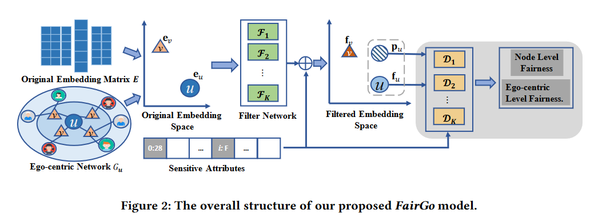

# Learning Fair Representations for Recommendation: A Graph-based Perspective

合肥工业大学-CCF-A

源代码https://github.com/newlei/FairGo 

## Q：论文要点？

- **使用生成对抗网络(GAN)训练的滤波器对原始的用户－物品embeddings向量进行转换，以除去用户的敏感信息**(该论文假定原始嵌入算法不可修改，只能在已经生成的embeddings向量上做转换)；
- **在GAN的优化目标函数(被称为价值函数)中加入用户－物品二分图的信息，以充分利用用户和物品的关系**。
- 除此之外，该论文通篇都散发着**表示学习（representation learning）[2]** 思想的光辉。

## Q：背景？

作为人工智能的一项重要应用，推荐系统是最普遍的计算机辅助系统之一，可帮助用户找到潜在的兴趣项目。最近，研究人员对人工智能应用的公平性问题给予了极大关注。这些方法大多假定了实例的独立性，并设计了复杂的模型来消除敏感信息，以促进公平性。然而，推荐系统与这些方法有很大不同，因为用户和项目自然形成了用户-项目双向图，并且在图结构中具有协作相关性。

## Q：推荐系统公平性？

- 提出了一种基于图的新技术，用于确保任何推荐模型的公平性。
- 这里的公平性要求是指在用户建模过程中不暴露敏感特征集。
- 具体来说，给定任何推荐模型的原始嵌入，我们学习过滤器的组合，根据敏感特征集将每个用户和每个项目的原始嵌入转换为过滤后的嵌入空间。对于每个用户，这种转换是在以用户为中心的图的对抗学习下实现的，目的是在过滤后的用户嵌入和该用户的子图结构之间混淆每个敏感特征。

## Q：fairgo模型？

- FairGo模型通过结合图表示学习和对抗学习的方法，旨在提高推荐系统中的公平性。
- 它首先利用图神经网络(GNN)从用户-项目交互图中学习用户和项目的嵌入表示。
- 然后，模型引入一个对抗网络来优化嵌入，使得从嵌入中难以推断出用户的敏感属性，如性别或年龄，从而减少偏见并提高推荐公平性。
- 具体来说，FairGo模型包括两部分：
- 一部分是基于GNN的推荐模型，负责学习高质量的嵌入；
- 另一部分是对抗网络，该网络试图从用户和项目的嵌入中预测敏感属性。通过最小化对抗网络的预测准确性，FairGo促进了生成的嵌入对敏感属性的不敏感性，同时保持了推荐的准确性。这种设计允许FairGo在维持推荐效果的同时，提升了系统的公平性。公式涉及的具体细节包括嵌入学习的优化目标和对抗训练的过程，这些通过精心设计的损失函数来实现，以平衡推荐性能和公平性的需求。

## Q：引言

虽然推荐系统可以更好地帮助用户找到潜在感兴趣的项目，但推荐结果也容易受到偏见和不公平的影响。例如，根据经验，当前的推荐结果比其他人群更青睐特定的人口群体 [8, 9]。中心的人工智能应用中普遍存在，如何评估和提高算法的公平性以使所有用户受益已成为一个热门研究课题[14, 25]。考虑到特定的敏感属性，研究人员设计了用于衡量监督环境中公平性的指标 [6, 14]。在所有去偏差模型中，由于表示学习技术的简单性、通用性和先进性，公平表示学习已经变得非常流行并被广泛研究[2,3,7,33,37]。这些公平表示学习方法学习数据表示以维持主要任务，同时过滤隐藏在数据表示中的任何敏感信息。公平性要求是通过特定的公平性正则化项来实现的[34,37,38]，或者依赖于对抗性学习技术[12]，在每个敏感属性值相同的情况下尝试匹配表示的条件分布[2,3,7] ，33]。

在本文中，我们关注公平推荐的公平表示学习，试图消除表示学习中的敏感信息[2,3,37]。这里，公平性要求是指推荐系统不暴露任何敏感的用户属性，例如性别、职业。事实上，最先进的推荐系统依赖于学习用户和项目嵌入来进行推荐。例如，流行的潜在因素模型学习免费的用户和项目嵌入以进行推荐[24, 26]。最近，研究人员认为，用户和项目自然地形成用户-项目二部图结构 [31, 32]，基于神经图的模型通过在用户和项目嵌入过程中注入图结构来学习用户和项目嵌入，然后接收状态-最先进的推荐性能 [21, 35]。由于学习用户和项目表示已成为现代推荐系统的关键构建块，我们还专注于学习公平用户和项目嵌入，以便公平表示学习可以集成到现代推荐架构中。换句话说，公平推荐问题转向学习公平的用户和项目表示，这样任何敏感信息都不会从学习的嵌入中暴露出来。

事实上，即使用户-项目交互行为没有明确包含任何用户敏感信息，直接应用最先进的用户和项目表示学习也会导致用户敏感信息泄漏，因为用户行为和她之间广泛支持的相关性社会理论中的属性[18,30,31]。例如，一项大规模研究表明，用户的私人特征（例如性别、政治观点）可以通过他们在 Facebook 上的相似行为来预测。因此，一个天真的想法是借用当前的公平感知监督机器学习技术来确保用户嵌入的公平性。该解决方案在一定程度上缓解了用户表示学习的不公平性。然而，我们认为由于推荐问题的独特性，它仍然远不能令人满意。大多数基于公平的机器学习任务都假设实体的独立性，并独立地消除每个实体的不公平性，而不需要对与其他实体的相关性进行建模。在推荐系统中，用户和项目自然地形成用户-项目二分图，并且在系统中协作相关。**在这些系统中，每个用户的嵌入不仅与她自己的行为相关，而且还与相似用户的行为或用户在相似项目上的行为隐式相关。**用户之间的协同相关性打破了以往基于公平的模型中的独立性假设，是基于协同过滤的推荐的基础。因此，即使用户的敏感属性从她的嵌入中被消除，以用户为中心的结构也可能会暴露她的敏感属性并导致不公平。为了验证这一假设，我们展示了一个示例，说明如何使用最先进的嵌入模型从该用户的本地图结构推断用户的属性。从图1b可以看出，用户的属性不仅通过她的嵌入暴露，还通过周围邻居的嵌入暴露。这项初步研究经验表明，每个用户的敏感属性也与以用户为中心的图有关。当用户和项目形成图结构时，从基于图的角度学习公平表示以进行推荐非常重要。

为此，在本文中，我们提出了一种基于图的视角，用于任何推荐模型的公平感知表示学习。我们认为，由于实际生产环境中的推荐模型是多样化且复杂的，因此所提出的模型应该更好地与模型无关。通过定义敏感特征集，我们提出的模型将来自任何推荐模型的用户和项目嵌入作为输入，并学习过滤空间，以便混淆敏感属性集中的任何敏感信息，同时保持推荐准确性。具体来说，我们学习每个敏感属性过滤器的组合，将每个用户和项目的原始嵌入转换为过滤后的嵌入空间。

由于每个用户都可以表示为以自我为中心的图结构，因此过滤器是在基于图的对抗训练过程中学习的。每个判别器都会尝试预测相应的属性，而过滤器的训练则是为了消除以用户为中心的图结构可能暴露的任何敏感信息。最后，我们在两个具有不同敏感信息的真实数据集上进行了广泛的实验。实验结果清楚地表明了我们提出的公平推荐模型的有效性。

图 1：两种推荐模型（PMF [24] 和 GCN [21]）在 MovieLens 数据集上进行敏感属性预测的性能。在学习了用户和项目嵌入之后，我们提取每个用户的第 l 个以用户为中心的子图嵌入。学习到的 l 阶嵌入向量被视为敏感属性预测的特征输入。我们观察到每个 l 阶以用户为中心的图表示都有助于属性预测。详细信息可以在实验中找到。

1. **介绍**：讨论了推荐系统中的公平性问题，指出了现有方法的局限性，并强调了采用基于图的方法解决公平性问题的必要性。
2. **相关工作**：回顾了推荐算法、算法公平性及其在推荐系统中应用的相关研究，为FairGo模型提供了理论背景和研究基础。
3. **FairGo模型**：
   - **3.1 总体架构**：描述了FairGo模型的设计，包括如何从任何推荐模型中获取用户和物品的原始嵌入，并通过一系列子过滤器转换这些嵌入，以隐藏敏感属性信息。
   - **3.2 基于图的对抗学习**：介绍了如何利用对抗学习技术在保留推荐准确性的同时，减少敏感属性信息的泄露，实现公平性。
4. **理论分析**：提供了FairGo模型有效性的理论支持，证明了模型在满足公平性要求的同时，能够保持推荐的准确性。

这些部分共同构成了论文的核心，提出了一种新的解决推荐系统中公平性问题的方法，并通过理论分析和实验验证了其有效性。

1. **原始嵌入矩阵 \( E \)**：这可能是网络中节点的初始表示，每个节点都有一个在高维空间中的嵌入向量。

2. **以自我为中心的网络 \( G_u \)**：这表示围绕特定节点 \( u \) 的网络，专注于从该节点的角度出发的连接和互动。

3. **敏感属性**：这些是节点的属性，由于公平性考虑，不应影响结果（如种族、性别等）。

4. **过滤网络**：这个网络接受原始嵌入和敏感属性，以产生更公平的过滤嵌入。它由多个过滤器 \( F_1, F_2, ..., F_K \) 组成。

5. **过滤后的嵌入空间**：过滤网络的结果，每个节点的嵌入都调整了，以满足公平性约束。

6. **\( f_u, p_u \)**：这些符号表示应用于节点 \( u \) 的公平性函数和与节点相关的概率分布（或某种权重），这些都是从过滤后的嵌入空间派生的。

7. **鉴别器 \( D_1, D_2, ..., D_K \)**：这些可能是评估过滤嵌入公平性的机制，确保敏感属性不会以有偏见的方式影响嵌入。

8. **节点级别公平性和以自我为中心的级别公平性**：这些是模型的输出，指示单个节点级别和从以自我为中心的网络角度看的公平性。

该模型的总体目标似乎是在保持数据效用的同时减少敏感属性对嵌入过程的影响，以实现更高的公平性水平。